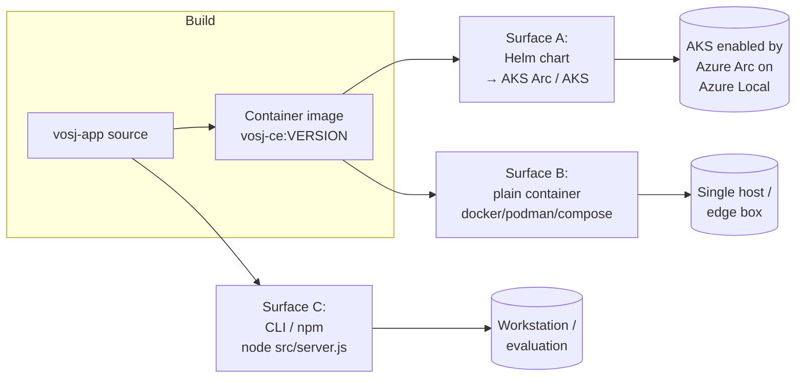
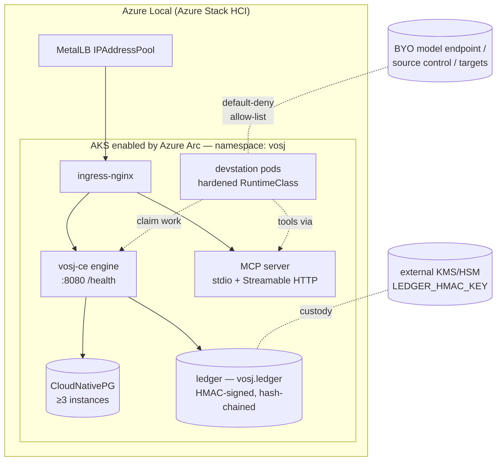
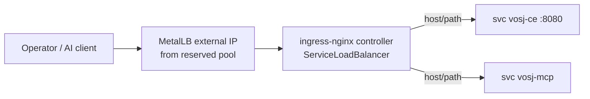
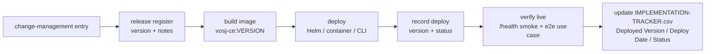

# Vosj Community Edition — DEPLOYMENT

> **Artifact 6 of 7** of the Vosj CE idea→production Formation suite.
> **Read order:** CORE-IDEA → PURPOSE → DESIGN → COST-MODEL → IMPLEMENTATION-PLAN → **DEPLOYMENT** → `IMPLEMENTATION-TRACKER.csv`.
> **Authoring discipline:** every factual claim is anchored to a repo path or to the white paper (`e:/apps/vosj/site/whitepaper.html`, section ids `s5/s9/s12/s14/s15`). Every sizing/timing estimate is marked `[ASSUMPTION]`. No fabricated metrics.
> **Binding foundation:** the white paper + the CE positioning (Apache-2.0 CE / managed Luca AI EE; bring-your-own-AI; verified-before-Jump fail-closed).
> **Scope of this document:** the *program-level* deploy runbook. The exact, copy-pasteable commands and manifests live next to the code at **`e:/apps/vosj/vosj-app/deploy/README.md`** — this file is the narrative, the gates, and the order; that file is the command surface. Where they disagree, `deploy/README.md` is authoritative for syntax and this file is authoritative for sequence and safety.

---

## §0 — Environment Facts

Vosj CE is a **standalone, self-hosted artifact** (`e:/apps/vosj/vosj-app`). It is **not** part of `luca-gateway`, it has **no Deploy Airlock**, **no Stripe / billing**, **no SaaS multi-tenancy**, and **requires no account**. The operator runs it on their own cluster with their own AI credentials (bring-your-own-AI). The closed Luca AI personas + per-engineer digital twins are the Enterprise add-on and are **not** part of this deploy.

| Fact | Value | Source |
|---|---|---|
| Artifact | `vosj-ce` container + Helm chart + CLI | `e:/apps/vosj/vosj-app/package.json` |
| Runtime | Node.js ≥ 20, Express, `pg` | `package.json` (`engines.node >=20`, deps `express`/`pg`/`dotenv`) |
| Entrypoint | `node src/server.js` (`npm start`) | `package.json` `scripts.start` |
| HTTP port | `VOSJ_PORT`, default **8080** | `src/config.js` (`PORT`) |
| Health route | **`GET /health`** (returns real engine + statestore + ledger metrics) | `src/engine/index.js`, `src/db/statestore.js`, `src/ledger/ledger.js` |
| License (code) | **Apache-2.0** — aligned across `package.json`, `LICENSE` (full text), `NOTICE` (creator attribution to Gustavo Assuncao / Gus IT LLC), and the CE site. | `package.json` `license`; `LICENSE`; `NOTICE`; CE site |
| DB | PostgreSQL (CloudNativePG recommended; BYO Postgres supported; in-memory for evaluation) | `src/config.js`, `src/db/pool.js` |
| Schema | single `vosj` schema, idempotent (`IF NOT EXISTS`) | `src/db/schema.sql` |
| Migration | `npm run migrate` or `psql -f src/db/schema.sql` | `package.json`, `src/db/pool.js` `migrate()` |
| Fail-closed secrets | `VOSJ_LEDGER_HMAC_KEY`, `VOSJ_VAULT_MASTER_KEY` — **no default, absence fails closed** | `src/config.js`, `.env.example` |
| Feature flag | `VOSJ_CE_ENABLED` (gates surfacing of in-progress capability) | this suite / `IMPLEMENTATION-TRACKER.csv` |
| **Primary test target** | **AKS enabled by Azure Arc on Azure Local (Azure Stack HCI)** | task brief; white paper §16 |
| Secondary target | Managed AKS / any conformant Kubernetes | this doc §11 |

**Golden-rule applicability (explicit):** Vosj CE is its own codebase, so the Luca Express *literal* Golden Rules (token-engine bridge, `aios-core-db` facade, AIOS Shell) do **not** bind it. Their **spirit** does and is enforced in code: config-driven (no hardcoded hosts/keys/thresholds — `src/config.js`), fail-closed gates (`src/engine/gate.js`, `src/ledger/ledger.js`), `verify()` mandatory on every Connector (`src/contracts/index.js`), and auth on routes (`VOSJ_AUTH_MODE`).

---

## §1 — Deploy Surfaces

Vosj CE ships **three install surfaces**. A given operator picks one; they are not layered.



| Surface | Use case | Path |
|---|---|---|
| **A. Helm chart on AKS Arc** | The reference / primary deploy. Full fabric: engine + Postgres (CNPG) + MCP server + optional devstation pods. | `deploy/helm/` → `deploy/README.md` §Helm |
| **B. Plain container** | Single-host / edge / air-gapped evaluation. One container + a Postgres (or in-memory). | `deploy/README.md` §Container |
| **C. CLI / npm** | Local evaluation, CI, contributor dev. In-memory StateStore, no cluster. | `deploy/README.md` §Local |

All three consume the **same** image and the **same** `VOSJ_*` configuration; only the orchestration differs.

---

## §2 — Pre-Deploy Gate (fail-closed)

Do not proceed past any unchecked item. These are the deploy-time projection of the white paper's six structural invariants (§12) and the POC/production gates (Appendices I.3 / I.7).

- [ ] **Image built and registered** — `vosj-ce:VERSION` exists in a registry the target cluster can pull, with the version recorded (no untracked tags). [ASSUMPTION] registry of operator's choice; the reference uses Azure Container Registry.
- [ ] **Fail-closed secrets generated and custodied OUTSIDE the database** — `VOSJ_LEDGER_HMAC_KEY` and `VOSJ_VAULT_MASTER_KEY` exist as Kubernetes Secrets / KMS references, never committed, never defaulted (§12.2/§15.2; `src/config.js`). Negative test: with the secret absent, signing/vault operations must **refuse** (return fail-closed), not run with a placeholder.
- [ ] **No-self-sign verified** — a deliberate attempt by an agent identity to sign its own gate **fails** (Invariant 1 / VG-01; `src/engine/gate.js`). This is a deploy acceptance test, not a policy note.
- [ ] **Verified-before-Jump present and non-removable** — the final Shift→Jump gate is engine-injected on every template; confirm a template cannot omit it (Invariant 6 / VG-10 / Claim 8; `src/engine/state-machine.js`, `templates/caf.json`).
- [ ] **Default-deny egress** — cluster network policy allows only: migration targets, the model endpoint (BYO-AI), source control, and cluster DNS (§15.8; breaks the lethal-trifecta exfiltration leg).
- [ ] **Auth on** — `VOSJ_AUTH_MODE=token` with a real `VOSJ_AUTH_TOKEN` (or OIDC at the ingress). `open` mode is **localhost-dev only** and must never reach a cluster (§config).
- [ ] **Postgres durable** (production) — quorum synchronous replication ≥ 3, WAL archiving, PITR, and a **tested restore** (§14.4). For evaluation the in-memory StateStore is acceptable and explicitly non-durable.
- [ ] **`pre-deploy` checks pass** — `npm test` green; `npm run migrate` dry-run / idempotency confirmed.

---

## §3 — AKS enabled by Azure Arc on Azure Local — Provisioning (primary target)

This is the reference deployment. Azure Local provides on-prem compute; AKS Arc gives an Arc-connected Kubernetes cluster on top of it. The white paper's primary test target (§16).

### 3.1 Prerequisites (reserve before you start)

1. **Azure subscription ID** of the Azure Local deployment.
2. **Custom Location ID** — the ARM resource ID of the custom location created during Azure Local setup.
3. **Microsoft Entra group** holding the cluster-admin users (`--aad-admin-group-object-ids`).
4. A **reserved on-prem IP range** for the load balancer that does **not** collide with Arc VM logical-network IPs, control-plane IPs, node IPs, or DHCP ranges (see §5). This is a hard networking prerequisite on Azure Local — there is no cloud LoadBalancer.
5. `az` CLI with the `aksarc` extension; `kubectl`.

### 3.2 Validate, then create the cluster

Always dry-run first. Exact flags in `deploy/README.md` §AKS-Arc.

```bash
# Dry-run validation (no resources created)
az aksarc create \
  --resource-group <rg> \
  --name vosj-ce \
  --custom-location <custom-location-id> \
  --aad-admin-group-object-ids <entra-admin-group-id> \
  --generate-ssh-keys \
  --validate

# Create for real (drop --validate)
az aksarc create \
  --resource-group <rg> \
  --name vosj-ce \
  --custom-location <custom-location-id> \
  --aad-admin-group-object-ids <entra-admin-group-id> \
  --generate-ssh-keys

# Fetch credentials
az aksarc get-credentials --resource-group <rg> --name vosj-ce
kubectl get nodes
```

AKS Arc clusters on Azure Local are **Arc-connected by default** — once created they appear in the Azure portal and accept Arc extensions (used below for MetalLB).

### 3.3 Namespace

```bash
kubectl create namespace vosj
kubectl config set-context --current --namespace=vosj
```



---

## §4 — Secrets Generation (fail-closed)

The two signing/encryption secrets are **never defaulted** and are **custodied outside the database** (§12.2/§15.2/§14.4). Generate strong random values and store them as Kubernetes Secrets (or, in production, as references to an external KMS/HSM — that is the durable custody path).

```bash
# 32-byte (256-bit) keys, hex-encoded
LEDGER_KEY=$(openssl rand -hex 32)
VAULT_KEY=$(openssl rand -hex 32)

kubectl create secret generic vosj-secrets -n vosj \
  --from-literal=VOSJ_LEDGER_HMAC_KEY="$LEDGER_KEY" \
  --from-literal=VOSJ_VAULT_MASTER_KEY="$VAULT_KEY" \
  --from-literal=VOSJ_AUTH_TOKEN="$(openssl rand -hex 24)"
```

**Acceptance:** delete one of the two keys from the Secret and restart a pod — ledger signing / vault operations must **fail closed** (refuse to proceed), proving there is no dev-key fallback. Restore the key before going further.

**Custody note:** for production, do **not** keep the HMAC key only in a Kubernetes Secret. Mount it from Azure Key Vault (CSI Secrets Store) or an HSM so a database compromise cannot forge or re-sign ledger rows (HMAC gives integrity against non-key-holders, not non-repudiation against a key-holding insider — hence the key lives outside the DB). The ledger rows are hash-chained (`vosj.ledger`) so tampering is detectable independent of the key.

---

## §5 — Networking (no cloud LoadBalancer)

On Azure Local there is no cloud LB, so a `Service type: LoadBalancer` would sit at `<pending>` forever. Resolve the external-IP layer with one of three options; the reference uses **MetalLB + ingress-nginx**.



| Option | When | Notes |
|---|---|---|
| **MetalLB (Arc extension) + ingress-nginx** *(reference)* | Most on-prem clusters | MetalLB L2 mode for a flat network, BGP mode where routers peer. One MetalLB IP fronts ingress-nginx; ingress does host/path routing for `vosj-ce` and the MCP server. Install MetalLB via the AKS Arc extension; see `deploy/README.md` §MetalLB. |
| **NodePort + external LB/DNS** | No spare IP pool; you already run a hardware LB | Expose `vosj-ce` on a NodePort; point your existing LB/round-robin DNS at the node IPs. |
| **3rd-party software/hardware LB** | Existing F5/HAProxy/etc. | Skip MetalLB; point the LB at NodePorts or at ingress-nginx NodePorts. |

**Hard rule:** the MetalLB `IPAddressPool` must use the IP range reserved in §3.1 and must **not** overlap Arc VM logical networks, control-plane IPs, node IPs, or DHCP. Verify before applying.

After ingress is up:

```bash
kubectl get svc -n ingress-nginx ingress-nginx-controller   # EXTERNAL-IP must be a real address, not <pending>
```

---

## §6 — Storage

| Need | Reference choice | Source |
|---|---|---|
| Default volumes | AKS Arc CSI VHDX-backed dynamic PVCs | Azure Local CSI disk docs |
| Postgres data | **Custom storage class pinned to SSD/NVMe-backed Cluster Shared Volumes**, `fsType: ext4` | Azure Local storage docs |
| Cold / archive | Separate HDD-backed storage class | Azure Local storage docs |

Create the SSD-backed storage class before deploying Postgres so the database PVCs land on fast media. Exact `StorageClass` manifest in `deploy/README.md` §Storage.

---

## §7 — Postgres: CloudNativePG (recommended) or BYO

Vosj CE persists its system-of-record (templates, workloads, waves, gates, **ledger**, waivers, tool log) in the `vosj` schema (`src/db/schema.sql`). Three postures:

### 7.1 CloudNativePG (recommended for production)

K8s-native HA: primary/standby streaming replication, automated quorum failover, PITR, and continuous object-store backup — no external HA tooling. Matches the white paper's durability requirement (§14.4: quorum sync ≥ 3 + WAL/PITR + tested restore).

```bash
# Install the CNPG operator (cluster-scoped), then a 3-instance cluster
# (manifests in deploy/README.md §CNPG)
kubectl apply -f deploy/cnpg/operator.yaml
kubectl apply -f deploy/cnpg/cluster.yaml   # 3 instances, SSD storage class, WAL archiving
kubectl get cluster -n vosj                 # wait for "Cluster in healthy state"
```

CNPG ships a **self-signed** server cert. Set `VOSJ_DB_SSL_REJECT_UNAUTHORIZED=false` so the engine accepts it (`src/config.js`), or mount the CNPG CA and keep verification on. The engine treats DB-with-host+user+database as "configured" and auto-selects the `pg` StateStore (`src/config.js`).

### 7.2 BYO Postgres

Point at any reachable PostgreSQL via `PG_HOST/PG_PORT/PG_USER/PG_PASSWORD/PG_DATABASE`. Keep `VOSJ_DB_SSL_REJECT_UNAUTHORIZED=true` unless your cert is self-signed.

### 7.3 In-memory (evaluation only)

Leave all `PG_*` blank → the engine selects the in-memory StateStore (`src/config.js`, `STATE_STORE='memory'`). **Non-durable** — state is lost on restart. For demos/CI only; never for a verified Jump you intend to keep.

---

## §8 — Database Migration

The schema is idempotent (`CREATE SCHEMA IF NOT EXISTS vosj` + `CREATE TABLE IF NOT EXISTS …`; `src/db/schema.sql`). Apply it two equivalent ways:

```bash
# A) via the app (reads PG_* from env, applies src/db/schema.sql)
npm run migrate
# → { ok: true, applied: 'schema.sql' }   (or { ok:false, error:'database not configured…' })

# B) directly via psql (e.g. as a Helm pre-install/post-install Job)
psql "$PG_DSN" -f src/db/schema.sql
```

In the Helm chart this runs as a one-shot migration **Job** before the engine Deployment becomes ready. Re-running is safe (idempotent). If `npm run migrate` returns `database not configured`, the `PG_*` trio is incomplete — fix env, don't force.

---

## §9 — Deploy the Engine (Helm) + `/health` Verification

```bash
helm upgrade --install vosj-ce deploy/helm/vosj-ce \
  --namespace vosj \
  --set image.repository=<registry>/vosj-ce \
  --set image.tag=<VERSION> \
  --set config.VOSJ_CE_ENABLED=true \
  --set config.VOSJ_AUTH_MODE=token \
  --set existingSecret=vosj-secrets \
  --set db.host=<cnpg-rw-service> --set db.sslRejectUnauthorized=false

kubectl rollout status deployment/vosj-ce -n vosj --timeout=5m
```

### 9.1 Health verification (REAL metrics, not `{ok:true}`)

`GET /health` returns live engine, statestore, and ledger health (`src/engine/index.js` counts; `src/db/statestore.js health()`; `src/ledger/ledger.js healthy()`). This is the post-deploy smoke gate — **verifying the feature alone is not enough**.

```bash
kubectl port-forward -n vosj svc/vosj-ce 8080:8080 &
curl -fsS http://localhost:8080/health | jq .
# Expect: ok:true, statestore reachable (kind: 'pg' in prod), ledger healthy (key present), version matches
```

Smoke checklist after every deploy:
- [ ] `/health` returns `ok:true` and the **expected statestore kind** (`pg` in prod, not `memory`).
- [ ] Ledger reports healthy (HMAC key present) — if it reports unhealthy, the Secret is missing/misnamed (fail-closed working as designed).
- [ ] An authenticated read against the API succeeds; an unauthenticated one is rejected (auth on).
- [ ] A real round-trip: create a demo workload (the `demo` connector, `src/connectors/demo.js`), advance one gate, confirm a signed row landed in `vosj.ledger`.

---

## §10 — Devstation Setup (BYO-AI execution substrate)

Devstations are the in-cluster autonomous engineering agents (the open execution substrate; the *managed* personas/twins that drive them are the closed EE add-on — **not** deployed here). In CE the operator brings their own model credentials and either drives the fleet by hand or wires their own MCP client.

Per the white paper §10, each devstation is **one identity, one clone, one model credential, one source-control credential, one worker loop** — never a shared working tree.

```bash
# 1. Hardened RuntimeClass (gVisor / Kata / Firecracker) — record the escape negative test
kubectl get runtimeclass                      # confirm a hardened class exists
# 2. Per-station identity + brokered short-lived creds (NOT long-lived shared keys)
#    BYO model seat + source-control token, vended per-task by the broker/sidecar (§10.4)
# 3. Deploy devstation pods from template (manifests in deploy/README.md §Devstations)
kubectl apply -f deploy/devstations/<role>.yaml   # role ∈ architect|builder|reviewer|tester|migrator|fixer|deployer
```

Requirements (all from §10/§15.8):
- **Hardened runtime class** so a container escape doesn't reach the node or neighbour pods (record the negative test).
- **Default-deny egress** — allow-list only model endpoint + source control + migration targets + DNS.
- **Per-station identity** distinct from the engine and from every other station (individually attributable in the tool-call log, `vosj.tool_log`).
- **Keepalive** controller relaunches a dead worker; **kill-switch + queue freeze + credential revocation** drilled before live data.
- Commit-via-PR is the **only** cross-station path — never a shared tree.

CE explicitly ships the devstation substrate **without** the managed AI brain. To run a station autonomously you supply a model credential; to use the EE Luca AI personas/twins you purchase the Enterprise add-on.

---

## §11 — Cloud-Managed AKS (secondary target)

The same image, Helm chart, and `/health` gate run on managed AKS (or any conformant Kubernetes); only the provisioning and the LB layer differ — managed AKS *does* give you a cloud LoadBalancer, so MetalLB is unnecessary.

```bash
az aks create -g <rg> -n vosj-ce --node-count 3 --generate-ssh-keys --enable-managed-identity
az aks get-credentials -g <rg> -n vosj-ce
kubectl create namespace vosj
# Secrets (§4), CNPG or BYO Postgres (§7), migration (§8) — identical
helm upgrade --install vosj-ce deploy/helm/vosj-ce -n vosj \
  --set image.tag=<VERSION> --set config.VOSJ_CE_ENABLED=true --set existingSecret=vosj-secrets
# Service type: LoadBalancer now gets a real cloud IP — skip MetalLB; ingress-nginx optional
```

Everything else — secrets, fail-closed gates, migration, devstations, `/health` smoke — is identical to §3–§10. Storage classes are the cloud defaults; pick a premium SSD class for Postgres.

---

## §12 — Feature-Flagging & Rollout

- **`VOSJ_CE_ENABLED`** gates any in-progress, user-facing surface. Ship dark, enable per the tracker's Exposure Cohort column. Never expose half-built capability without the flag (Multi-Agent CD non-negotiable).
- **Verified-before-Jump is never behind a flag** — it is structural (Invariant 6 / VG-10). No flag, env var, or template may disable it.
- **Rollout order:** migration Job → engine (dark, `VOSJ_CE_ENABLED=false`) → `/health` green → flip the flag for the evaluation cohort → run the end-to-end use case (§IMPLEMENTATION-PLAN) → widen cohort.
- **License reconciliation — RESOLVED (2026-06-23):** CE is **Apache-2.0**, aligned across `package.json`, the `LICENSE` file (full Apache 2.0 text), the `NOTICE` file (creator/author attribution to Gustavo Assuncao / Gus IT LLC), and the CE site (EN/FR/DE/ES/PT). The earlier AGPL-3.0-only-vs-BSL-1.1 mismatch is closed; the managed Luca AI personas / per-engineer twins remain proprietary EE (not under Apache-2.0).

---

## §13 — Scaling

| Lever | How | Notes |
|---|---|---|
| Engine throughput | `kubectl scale deployment/vosj-ce --replicas=N` (stateless; state in Postgres) | HPA on CPU optional; the real ceiling is **review bandwidth**, not engine replicas (white paper §20). |
| Postgres | CNPG instance count + read replicas | Quorum sync ≥ 3 for production (§14.4). |
| Fleet | Add devstation pods per role | Throughput bounded by orchestration/review, not headcount (§10.3); flat-rate model seats carry fair-use ceilings → queue/throttle at the ceiling (§22). |
| Storage | Grow PVCs / add SSD CSV capacity on Azure Local | Pre-size for ledger growth (append-only, hash-chained). |

**Do not** scale by relaxing a gate or a verification threshold. Structurally-enforced properties have an expected violation count of **zero**; any non-zero count is an engine defect, not a tuning knob (white paper §20).

---

## §14 — Teardown

```bash
# 1. Drain devstations gracefully (archive transcripts first), then remove
kubectl delete -f deploy/devstations/ -n vosj
# 2. EXPORT the evidence package before deleting state (VG-26): signed ledger,
#    waiver register, reconciliation proofs, tool-call/order log, framework binding.
#    The HMAC key (external) is required to re-verify the chain later — keep it.
# 3. Remove the engine + MCP
helm uninstall vosj-ce -n vosj
# 4. Postgres: back up (PITR/object store) BEFORE deleting the CNPG cluster
kubectl delete cluster vosj-pg -n vosj     # only after a verified backup
# 5. Namespace + (optionally) the AKS Arc cluster
kubectl delete namespace vosj
az aksarc delete --resource-group <rg> --name vosj-ce   # frees Azure Local capacity
```

**Order matters:** export the VG-26 evidence package and back up Postgres **before** deleting state. The ledger is the audit system-of-record; losing it unverified defeats the auditability invariant.

---

## §15 — Closure Loop (Formation discipline)

A Vosj CE release is "done" only after the full idea→production loop, adapted to a standalone self-hosted artifact (there is no luca-gateway airlock here):



1. **change-management entry** — record the release intent.
2. **release register** — version + release notes (CE versioning is its own, e.g. `0.1.0`+).
3. **build** — `vosj-ce:VERSION` to the registry; record the tag (never deploy an untracked tag).
4. **deploy** — Surface A/B/C per §1.
5. **record deploy** — version + status.
6. **verify live** — the `/health` smoke checklist (§9.1) **and** at least one end-to-end run through a verified Jump (the IMPLEMENTATION-PLAN end-to-end use case).
7. **update the tracker** — `IMPLEMENTATION-TRACKER.csv`: `Deployed Version`, `Deploy Date`, `Status`, `Validator Sign-off`.

---

## §16 — Cross-References & Sources

- **Exact commands & manifests:** `e:/apps/vosj/vosj-app/deploy/README.md` (authoritative for syntax).
- **Authoritative design:** `e:/apps/vosj/site/whitepaper.html` (§9 MCP, §10 devstations, §12 invariants, §14 data model/durability, §15 security, §16 connectivity, Appendices H/I).
- **Code anchors:** `src/config.js` (env), `src/db/pool.js` + `src/db/schema.sql` (migration/schema), `src/engine/` (gate FSM, disposition, reconcile, template), `src/ledger/ledger.js` (HMAC ledger), `.env.example`.
- **AKS Arc / Azure Local:** What is AKS enabled by Azure Arc — https://learn.microsoft.com/en-us/azure/aks/aksarc/aks-overview · `az aksarc create` — https://learn.microsoft.com/en-us/azure/aks/aksarc/aks-create-clusters-cli · cluster architecture — https://learn.microsoft.com/en-us/azure/aks/aksarc/cluster-architecture · baseline architecture — https://learn.microsoft.com/en-us/azure/architecture/example-scenario/hybrid/aks-baseline · network requirements — https://learn.microsoft.com/en-us/azure/aks/aksarc/aks-hci-network-system-requirements
- **Networking:** MetalLB for AKS Arc — https://learn.microsoft.com/en-us/azure/aks/aksarc/load-balancer-overview · MetalLB via CLI — https://learn.microsoft.com/en-us/azure/aks/aksarc/deploy-load-balancer-cli · ingress-nginx bare-metal — https://kubernetes.github.io/ingress-nginx/deploy/baremetal/
- **Storage:** CSI disk drivers (AKS Arc) — https://learn.microsoft.com/en-us/azure/aks/aksarc/container-storage-interface-disks · storage options — https://learn.microsoft.com/en-us/azure/aks/aksarc/concepts-storage
- **Postgres:** CloudNativePG — https://cloudnative-pg.io/
- **Licensing:** Apache License 2.0 — https://www.apache.org/licenses/LICENSE-2.0 · SPDX Apache-2.0 — https://spdx.org/licenses/Apache-2.0.html

---

*Vosj — an open-source project of Gus IT LLC. «Chaque migration est un voyage.»*
