# Vosj Community Edition — DESIGN

> **Artifact 3 of 7** in the Formation suite. Read order: **CORE-IDEA → PURPOSE → DESIGN → COST-MODEL → IMPLEMENTATION-PLAN → DEPLOYMENT → IMPLEMENTATION-TRACKER.csv**.
>
> **Authoring discipline.** Every factual claim is anchored to a repository path (`src/...`, `templates/...`) or to a white-paper section id (`s5/s6/s7/s8/s9/s10/s11/s12/s13/s14/s15/s16/s17`) in the authoritative design document `e:/apps/vosj/site/whitepaper.html`. Every projection or estimate is marked `[ASSUMPTION]`. No metric is fabricated. Mermaid diagrams are normative wherever they restate a contract that exists in code.
>
> **Binding foundations.** (1) The IP white paper `e:/apps/vosj/site/whitepaper.html` (v2.0, 2026-06-21). (2) The Luca Express *App / Game / Big-Task Formation Standard* in `e:/apps/Luca-express-prod/CLAUDE.md`. (3) The CE-vs-EE boundary: **the plumbing is open; the AI brain is the add-on.** CE is **bring-your-own-AI**, self-hosted, local-first.
>
> **Status legend used below.** `BUILT` = file present in `src/`/`templates/` today. `BUILD-PENDING` = specified here, generated by the separate code workflow (the server/API/MCP/UI layers were not yet present in `src/` at the time this document was written). `[ASSUMPTION]` = a design choice not yet pinned in code or white paper.

«Chaque migration est un voyage» — every migration is a voyage.

---

## §0 Document map

| Section | Subject |
|---|---|
| §1 | Where it lives (standalone repo; divergence from in-gateway Luca apps) |
| §2 | Engine module contract + the five plugin contracts (the contribution surface) |
| §3 | Architecture & execution fabric on AKS-on-Azure-Local (Command Center, devstations, MCP, engine) |
| §4 | The V·O·S·J phase-gate state machine (data-driven, compiled from a framework template) |
| §5 | 7-R disposition engine (typed contracts; Strangler-Fig structurally enforced) |
| §6 | MCP server & durable order queue (the BYO-AI seam) |
| §7 | Tamper-evident ledger & gate-signing engine (the six invariants) |
| §8 | Reconciliation & verified-before-Jump (`π(w)`, fail-closed) |
| §9 | Connector lifecycle (`discover·replicate·verify·cutover·rollback`) |
| §10 | Data model (`vosj` schema; StateStore) |
| §11 | UI surfaces (Command Center, live infra view, console) |
| §12 | Devstation fleet (CE substrate vs EE managed AI) |
| §13 | CI/CD & DevOps 365° assessment |
| §14 | Engineering standards (which Luca Golden Rules apply to the standalone repo) |
| §15 | Build sequence |
| §16 | Open questions |

---

## §1 Where it lives

Vosj CE is a **standalone repository** at `e:/apps/vosj/vosj-app`. It is **NOT** a domain module inside `luca-gateway`, and this is a deliberate divergence from every other Luca app (e.g. `aios-core-apps/domains/operate/apps/ai-workforce`, which ships *inside* the gateway image). The reasons:

- CE is **self-hosted by the operator** under **Apache-2.0** (see `package.json`: `"license": "Apache-2.0"`).
  - **License note — RESOLVED (2026-06-23, Open Question §16-Q1).** The license is now **Apache-2.0**, aligned across `package.json`, the `LICENSE` file (full Apache 2.0 text), the `NOTICE` file (creator/author attribution to Gustavo Assuncao / Gus IT LLC), and the CE site. The earlier AGPL-3.0-only-vs-BSL-1.1 divergence is closed. Apache-2.0 is permissive with an explicit patent grant + retaliation clause — chosen to protect the prior art behind the design (backed by technical publications) while keeping adoption frictionless; the managed Luca AI / twins remain proprietary EE.
- CE has **no Luca Golden-Rule literal binding** — it does not import `token-engine.js`, `aios-core-db`, or AIOS Shell. It carries the *spirit* of the rules in its own primitives (§14).
- CE has **no SaaS multi-tenancy, no Stripe, no per-tenant KEK, no billing** — those belong to the closed/managed Enterprise plane, not CE.

```
e:/apps/vosj/vosj-app
├── package.json            # name "vosj-ce", Apache-2.0, node>=20, scripts: start/dev/test/migrate   [BUILT]
├── .env.example            # every value has a safe default EXCEPT the fail-closed secrets             [BUILT]
├── .dockerignore .gitignore                                                                            [BUILT]
├── templates/
│   └── caf.json            # flagship CAF 7-phase template, P1..P7 → V·O·S·J, cutover gate at P6        [BUILT]
├── src/
│   ├── config.js           # frozen config; fail-closed secrets have NO default                         [BUILT]
│   ├── contracts/index.js  # Connector / Executor / GateSigner / AssessmentProvider / StateStore        [BUILT]
│   ├── engine/
│   │   ├── index.js        # buildEngine() facade (templates, 7-R, FSM, signer, reconcile)              [BUILT]
│   │   ├── template.js     # framework template engine: load/compile JSON → FSM                          [BUILT]
│   │   ├── state-machine.js# signed-gate phase FSM + unit lifecycle; injected cutover gate              [BUILT]
│   │   ├── disposition.js  # 7-R typed-contract table + classify()                                       [BUILT]
│   │   ├── gate.js         # HumanGateSigner: human-only, separation-of-duties, verified-before-cutover [BUILT]
│   │   └── reconcile.js    # equivalence proof π(w); pre-switch categories; fail-closed                  [BUILT]
│   ├── ledger/ledger.js    # tamper-evident hash-chained HMAC ledger; fail-closed key                    [BUILT]
│   ├── connectors/demo.js  # working in-memory demo connector (real verify() proof)                      [BUILT]
│   ├── db/
│   │   ├── pool.js         # pg pool + parameterised query facade + migrate()                            [BUILT]
│   │   ├── statestore.js   # MemoryStateStore + PgStateStore + createStateStore()                        [BUILT]
│   │   └── schema.sql      # `vosj` schema: templates/workloads/waves/gates/ledger/waivers/tool_log     [BUILT]
│   ├── server.js           # Express bootstrap (package.json main + start script)               [BUILD-PENDING]
│   ├── api/                # REST routes (requireAuth/requireCapability) over the engine facade  [BUILD-PENDING]
│   ├── mcp/                # MCP server (stdio + Streamable HTTP) + durable order queue          [BUILD-PENDING]
│   ├── auth/               # token/open auth middleware (config.AUTH_MODE)                       [BUILD-PENDING]
│   └── ui/                 # static Command Center + live infra view + console                  [BUILD-PENDING]
├── test/                   # node:test suites (npm test = `node --test`)                        [BUILD-PENDING]
├── deploy/                 # Helm chart / container manifests for AKS-on-Azure-Local            [BUILD-PENDING]
└── docs/                   # this Formation suite                                                        [BUILT]
```

`package.json` declares `"main": "src/server.js"` and `"start": "node src/server.js"` — so `src/server.js`, `src/api/`, `src/mcp/`, and `src/ui/` are the named, expected surfaces the separate code workflow fills in. This document specifies their contracts so they generate correctly.

---

## §2 Engine module contract + the five plugin contracts

### §2.1 The engine facade

The engine is assembled by `buildEngine({ config, store, ledger })` in `src/engine/index.js` (BUILT). It is the single object the API, MCP, and UI layers call — the analogue of a Luca domain-module's exported contract, but self-contained.

`buildEngine` requires a `ledger` (throws otherwise), instantiates a `HumanGateSigner`, loads every `templates/*.json`, and returns:

| Member | Source | Purpose |
|---|---|---|
| `listTemplates()` / `getTemplate(id)` / `compileTemplate(json)` | `engine/template.js` | Browse / bind / clone framework templates (§4). |
| `classify(workload)` / `contractFor(d)` / `dispositions` | `engine/disposition.js` | The 7-R engine (§5). |
| `machineFor(templateId)` | `engine/state-machine.js` | A `StateMachine` bound to one template (§4). |
| `unitStates()` / `injectedCutoverGate` | `engine/state-machine.js` | Unit lifecycle + the non-removable cutover gate (§4, §8). |
| `reconcile(unit, connector, ctx)` | `engine/reconcile.js` | Produce the equivalence proof `π(w)` (§8). |
| `counts()` | `StateStore` | Real metrics for `/health` (workloads, waves). |
| `signer`, `config` | — | The gate signer and the frozen config. |

### §2.2 The five plugin contracts — the contribution surface

All five live in `src/contracts/index.js` (BUILT) as base classes whose every method `throw`s `not implemented`, so a half-built plugin fails loudly. **This is where the community extends Vosj.** Lead any contributor-facing doc with this table.

| Contract | Methods | Invariant it carries |
|---|---|---|
| **`Connector`** | `discover · replicate · verify · cutover · rollback` | **`verify()` is MANDATORY** (`src/contracts/index.js` lines 22–23): a cutover cannot be *proven* without it (§13/§8). |
| **`Executor`** | `run(step, ctx)` | Runs one runbook step; the station conductor invokes it but never bypasses its internal checks (§16 of the white paper). |
| **`GateSigner`** | `sign(gate, signer)` + static `assertHumanIndependent` | **Human-only, no self-sign** (Invariants 1 & 2). The static guard rejects non-human signers and author==signer (`src/contracts/index.js` lines 41–49). |
| **`AssessmentProvider`** | `assess(target)` | Produces the CI/CD-365° / readiness score consumed in the Vault station (§13). |
| **`StateStore`** | workloads / waves / gates / ledger / tool-log CRUD | Persistence. Two concrete impls ship: `MemoryStateStore`, `PgStateStore` (`src/db/statestore.js`). |

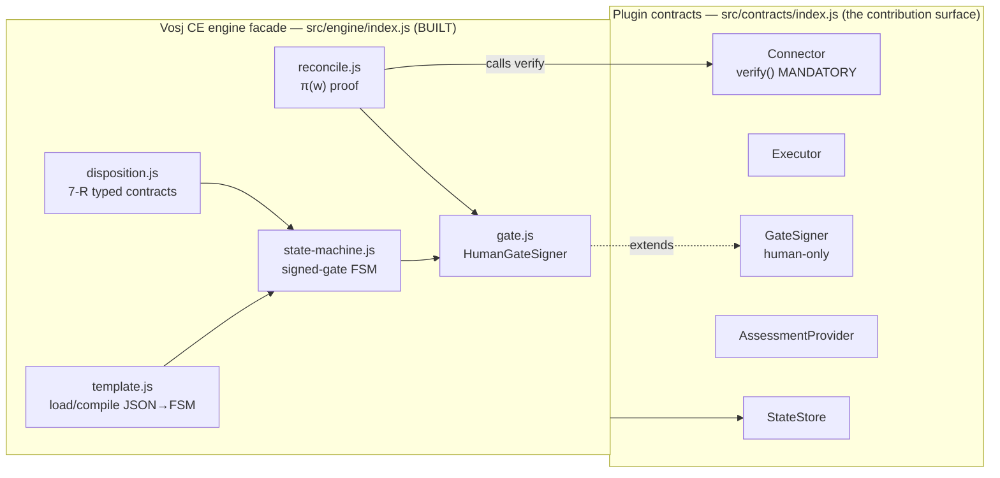

---

## §3 Architecture & execution fabric on AKS-on-Azure-Local

### §3.1 Five layers (white-paper §5.2, Fig 2; Appendix C)

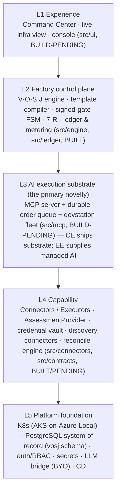

Architectural principle (white-paper §5): **extend, do not fork** — Vosj productises and unifies existing migration capability behind stable contracts; it does not re-implement disk replication or DB-migration services.

### §3.2 The reference deployment substrate — AKS enabled by Azure Arc on Azure Local (Azure Stack HCI)

This is the **primary test target** for CE and the reference deployment throughout the Formation suite. AKS enabled by Azure Arc extends AKS on-premises onto Azure Local; clusters are **Arc-connected by default** and managed via Azure portal, `az aksarc`, or ARM templates (ref: Microsoft Learn, *What is AKS enabled by Azure Arc?*).

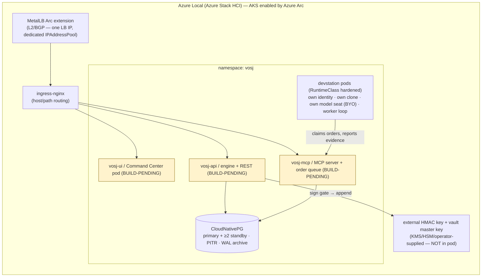

**Hard substrate facts folded into DEPLOYMENT (cited there):**
- **No cloud LoadBalancer on-prem** → `type: LoadBalancer` stays `pending`. Resolve with the **MetalLB Arc extension** (L2 for a flat network, BGP where routers peer) fronted by **ingress-nginx** (standard bare-metal ingress topology). MetalLB needs a **dedicated IPAddressPool** that must not collide with Arc VM logical-network IPs, control-plane IPs, node IPs, or DHCP ranges.
- **Storage** defaults to CSI VHDX-backed volumes; pin Vosj/PG data to a **custom SSD/NVMe-backed storage class** (`fsType: ext4`).
- **PostgreSQL HA** via **CloudNativePG** (matches the white-paper §14.4 durability requirement and Luca's CNPG usage): primary/standby streaming replication, quorum failover, PITR, object-store continuous backup.
- **Provision** with `az aksarc create` (precede with `--validate` dry run); prerequisites are the Azure subscription ID of the Azure Local deployment, the **Custom Location ID**, and a Microsoft **Entra cluster-admin group**.

---

## §4 The V·O·S·J phase-gate state machine

The brand letters **are** the FSM stations (white-paper Claim 1). Two FSMs coexist in `src/engine/state-machine.js` (BUILT):

1. **The phase machine** — template states `P1..Pn`, one gated transition per phase exit. Allowed transitions + signer roles come from the **bound template's rows**, not from constants (`StateMachine.listValidNextStates` / `signTransition`, lines 43–76).
2. **The unit lifecycle** — `legacy → dual_running → reconciled → migrated`, strictly forward, one step at a time (`UNIT_STATES`, `canUnitTransition`, lines 15, 81–87). The final `reconciled → migrated` step is **cutover** and is the engine-injected, non-removable gate.

### §4.1 Compiling a template into an FSM (white-paper §8, Fig 3)

`src/engine/template.js` (BUILT) `compile(json)` normalises a methodology JSON into `{ id, name, version, source, phases[], states[], transitions[] }`. States default to ordered phase ids; transitions default to linear `phase[i] → phase[i+1]` gated by `phase[i]`'s exit gate. The signing/RBAC machinery is **reused unchanged** — only the *source* of phases/gates is data (white-paper Claim 2). The flagship `templates/caf.json` (BUILT) is the worked instance: seven phases mapped onto V·O·S·J.

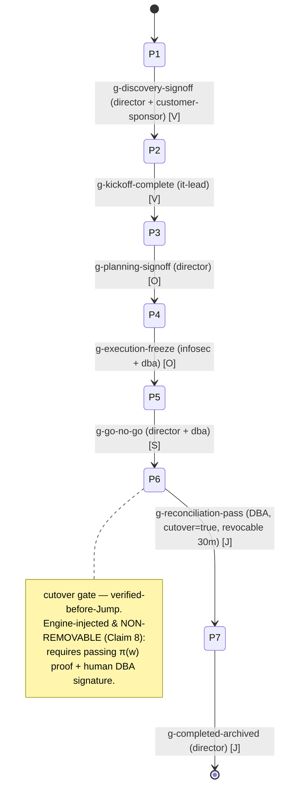

### §4.2 The signed transition (white-paper §14.1)

`StateMachine.signTransition({ run, to, actor, signer, evidence, proof })` (lines 57–76, BUILT):
1. finds the `from→to` transition in the bound template (throws if none);
2. resolves the gate definition (throws if the transition has no gate);
3. builds the gate object and calls `this.signer.sign(gate, signer)`;
4. returns `{ state: to, gate: gate.id, ledger: row }` — i.e. the move is *committed only as a signed ledger row* (§7).

### §4.3 The non-removable cutover gate (white-paper Claim 8 — the strongest claim)

`INJECTED_CUTOVER_GATE` (lines 17–26, BUILT) is `engine.verified-before-jump`, `signerRole: 'dba'`, `cutover: true`, with criteria `['reconciliation proof passing','human DBA signature']`. `indexTemplate()` (lines 114–122) makes it addressable on **every** template, so a template author **cannot delete it**. `cutoverUnit()` (lines 91–111) refuses unless `proof.ok === true` **and** a human signature is applied → **non-verified cutover is an unreachable state, not a policy violation.**

---

## §5 7-R disposition engine

`src/engine/disposition.js` (BUILT) holds the 7-R table where each disposition is a **typed contract** `⟨executorClass, runbookTemplate, reconciliationProfile, cutoverStyle⟩` (white-paper §7.1):

| Disposition | executorClass | runbookTemplate | reconciliation | cutoverStyle | highRisk | delivery precond. |
|---|---|---|---|---|---|---|
| Retire | none | decommission | none | none | – | – |
| Retain | none | split-environment | none | none | – | – |
| Rehost | rehost | rehost-near-zero-downtime | standard | **big-bang** | – | – |
| Relocate | relocate | relocate-replication-assisted | standard | **strangler-fig** | ✔ | – |
| Repurchase | repurchase | data-extract-cutover | standard | **big-bang** | – | – |
| Replatform | replatform | replatform-reshape | tightened | **strangler-fig** | ✔ | CI/CD-365° ✔ |
| Refactor | refactor | refactor-strangler | tightened | **strangler-fig** | ✔ | CI/CD-365° ✔ |

**Structural guarantee (white-paper §7 callout):** the high-risk reshapes (Refactor/Replatform/Relocate) carry `cutoverStyle === 'strangler-fig'`, so they resolve only to incremental, parallel-run runbooks — **a big-bang plan is physically unrepresentable** for them. `classify(workload)` (lines 78–90) uses an explicit `workload.disposition` or a conservative `heuristic()`; either way the *contract table* — not the guess — determines whether big-bang is available (returns `strangler` / `bigBangAvailable` booleans). Replatform/Refactor additionally carry `deliverySystemPrecondition: true` → the planning gate cannot select them until the CI/CD-365° readiness gaps (§13) are closed.

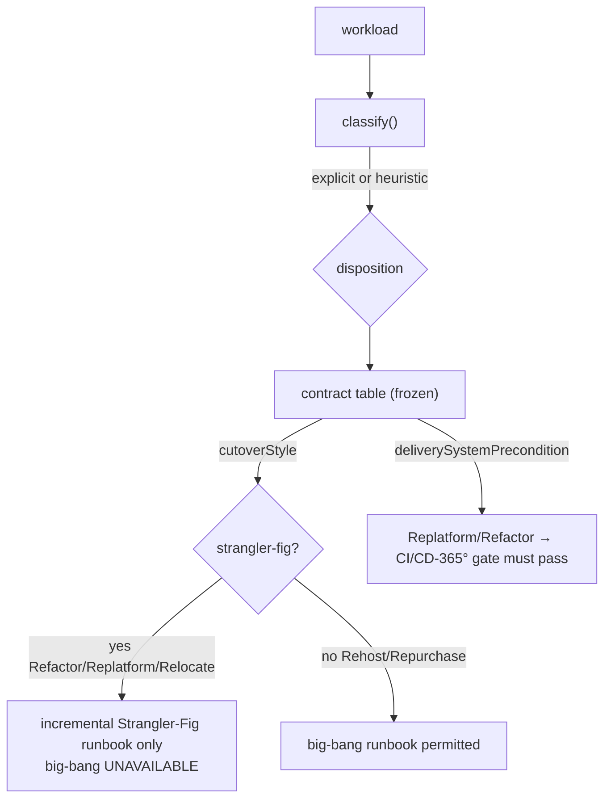

---

## §6 MCP server & durable order queue — the BYO-AI seam  *(BUILD-PENDING)*

MCP is the open standard, **JSON-RPC 2.0**, over **stdio** (local child process / CLI) and **Streamable HTTP** (standalone HTTP+SSE is deprecated as of the 2025-06-18 revision; HTTP sessions carry the `Mcp-Session-Id` header). The Vosj MCP Hub works two directions (white-paper §9):

- **Outbound (agents → systems):** the Hub is the registry + connection manager for external MCP servers (source control, issue tracking, messaging, cloud providers, migration executors). On a tool call it routes, **injects credentials from secrets at connect time**, enforces per-tool authz, applies timeouts, and **logs the call to `vosj.tool_log`** (the audit substrate for Invariant 4 / R8 — table is BUILT in `schema.sql`).
- **Inbound (clients → platform):** the Hub exposes selected platform services as MCP servers.

**This is the CE↔EE seam.** CE ships the MCP server; the operator brings their own AI client (or drives by hand). EE supplies the managed personas/twins as MCP clients. The Vosj MCP server acts as an **OAuth 2.1 resource server**: it MUST validate the access-token **audience** and accept only tokens issued for it (RFC 8707); clients MUST send the `resource` parameter with the server's canonical URI (refs: MCP *Authorization* / *Transports* specs; RFC 8707). Per-tool RBAC, signed-server allow-lists, and capability checks are **Vosj-Hub controls layered on top** of MCP, not MCP guarantees (white-paper §9.1).

**Order dispatch is a composition, not an MCP property** (white-paper §9.2, Claim 4): the order channel is a **DB-backed durable work queue**, not an MCP call. An operator (human or supervising agent) enqueues a work order; a target devstation **claims it atomically** (`open → in_progress`), executes on its own isolated clone, and reports progress + signed evidence. MCP is used *within* execution for governed *tool* access. This decouples *who issues work* from *where work runs*.

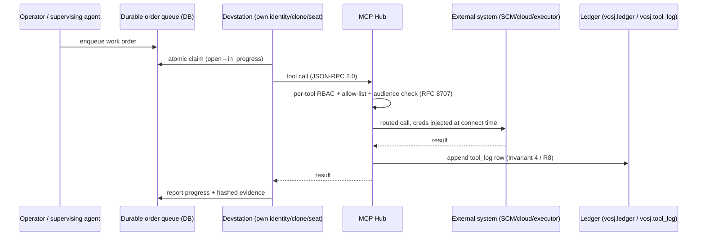

**`[ASSUMPTION]`** the queue is implemented on `vosj` PostgreSQL with `SELECT ... FOR UPDATE SKIP LOCKED` for atomic claim; the table name/columns are specified in IMPLEMENTATION-PLAN, not yet in `schema.sql`.

---

## §7 Tamper-evident ledger & gate-signing engine — the six invariants

### §7.1 The ledger (`src/ledger/ledger.js`, BUILT)

Each row carries an **HMAC-SHA256** over `prevHash + canonical(entry)` using the **externally-custodied** key `config.LEDGER_HMAC_KEY`. The chain is genesis-rooted (`GENESIS = '0'×64`). Key properties:
- **Fail-closed (Invariant 5):** `_key()` throws `ledger fail-closed: VOSJ_LEDGER_HMAC_KEY is not set` — there is **no default-key fallback** (lines 34–41).
- **Tamper-evident (Invariant 4):** `verifyChain()` recomputes every HMAC and returns `{ ok, brokenAt }` at the first forged/back-dated row (lines 77–94).
- **Canonical JSON** (sorted keys) makes the HMAC reproducible across MemoryStateStore and PgStateStore (the `mapLedgerRow()` round-trip in `statestore.js` exists precisely so `verifyChain()` recomputes the same hash it wrote).
- **External key custody:** HMAC gives integrity vs. non-key-holders, not non-repudiation vs. a key-holding insider → the key lives in KMS/HSM/vault, **never in the pod** (white-paper §14.4).

### §7.2 The gate signer (`src/engine/gate.js`, BUILT)

`HumanGateSigner.sign(gate, signer)` enforces, in order:
1. `GateSigner.assertHumanIndependent` → **human-only (Inv. 1)** + **author ≠ signer (Inv. 2)** (`gate.js` line 30 → `contracts/index.js` lines 41–49).
2. **Role match** — `gate.signerRole` must equal `signer.role` (lines 33–37).
3. **Machine-checkable criteria** — refuse if `gate.criteriaMet === false` (lines 40–42).
4. **Verified-before-cutover (Inv. 6)** — a `cutover`/`requiresProof` gate is rejected without a passing `proof` carrying `ok === true` and a `hash` (lines 45–50).
5. On success it appends the signed row to the ledger and projects a queryable `vosj.gates` row.

### §7.3 The six structural invariants (white-paper §12) → where each is enforced

| # | Invariant | Enforced in |
|---|---|---|
| 1 | No agent self-signs a gate | `contracts/index.js` `assertHumanIndependent` (signer.kind==='human') |
| 2 | Separation of authoring & authorising | same guard (author !== signer.id); plus fleet role specialisation (§12) |
| 3 | Four-eyes change validation | reviewer fleet role produces a diff-impact report before a dependent gate (§12) `[ASSUMPTION on UI/flow wiring]` |
| 4 | Tamper-evident transitions | `ledger.js` HMAC hash-chain + `verifyChain()` |
| 5 | Fail-closed by default | `ledger._key()` throws on missing key; `reconcile.isFreshBaseline()` returns false with no baseline; `config.js` secrets have no default |
| 6 | Verified-before-cutover | `gate.js` step 4 + `state-machine.cutoverUnit()` proof check + injected non-removable gate |

**Bound capability, not intent (white-paper §12 callout):** invariants bound *capability*; a prompt-injected agent can misuse tools it already holds → the **human-signed gate is the load-bearing backstop** for irreversible steps (cutover, decommission, credential rotation). Vosj never claims to make a compromised agent safe — it claims the irreversible action cannot complete without an independent human signature recorded in a tamper-evident ledger.

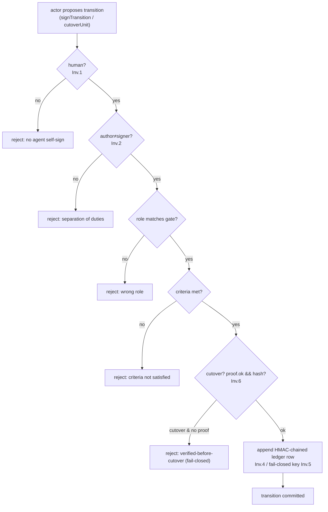

---

## §8 Reconciliation & verified-before-Jump

`src/engine/reconcile.js` (BUILT) produces the equivalence proof `π(w)`. `reconcile(unit, connector, ctx)`:
- requires a `connector` with `verify()` (throws otherwise — ties to the mandatory Connector method);
- checks `isFreshBaseline(unit, config)` against `config.baselineMaxAgeMs` (default 24h, configurable via `VOSJ_BASELINE_MAX_AGE_MS`) — **no baseline ⇒ not fresh ⇒ fail-closed** (the baseline-drift guard, white-paper §13.1, VG-07);
- normalises the connector's categories against the six **pre-switch hard-gate categories** `['replication_lag','row_counts','checksums','sequence_identity','constraints','smoke']` — **any unreported pre-switch category counts as `not reported (fail-closed)`**;
- carries through extra (post-cutover) categories the connector reports (e.g. plan/performance parity, which is a **P6 post-cutover** check in the 30-minute revocable window, *not* a P5 pre-switch blocker, per white-paper §13);
- computes `ok = result.ok && preSwitchOk && baselineFresh` and returns a **stable-stringify SHA-256 `proof.hash`** that the cutover gate binds.

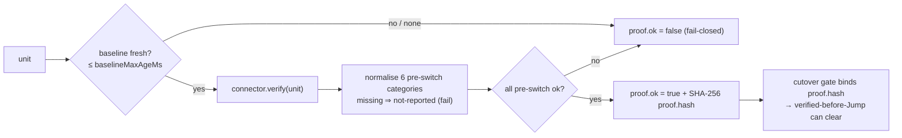

The demo connector (`src/connectors/demo.js`, BUILT) returns a genuine structured `verify()` proof across all six categories, so the engine, API, and UI function out-of-the-box with `STATE_STORE=memory` and **no real cloud** — the verified-before-Jump gate actually clears in a demo run.

---

## §9 Connector lifecycle

A `Connector` (white-paper §16.2) owns one source→target pair and an internal state machine. The five methods on the contract map to the white-paper executor lifecycle `draft → validated → executing → completed | failed → rolling-back → rolled-back`:

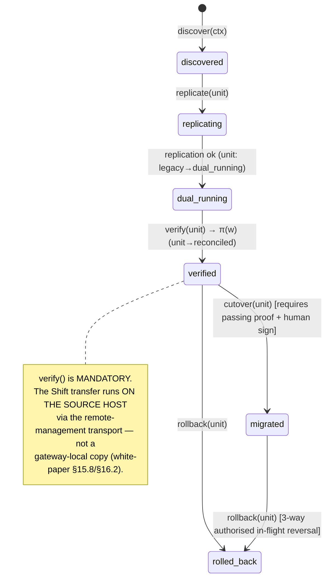

The conductor (the Shift station) invokes executors **via the bridge but never bypasses** their pre-flight checks. Connectors are registered in a **catalog** (registration, not rewrite — white-paper §16.1); the demo connector is the reference implementation and the template for community-contributed `migrate-<source>-to-<target>` connectors.

---

## §10 Data model

Relational, **schema-per-domain isolation** in schema `vosj` (`src/db/schema.sql`, BUILT). The white paper splits the model across three logical domains (migration / framework / agent); the CE build collapses them into one idempotent schema while keeping the conceptual split:

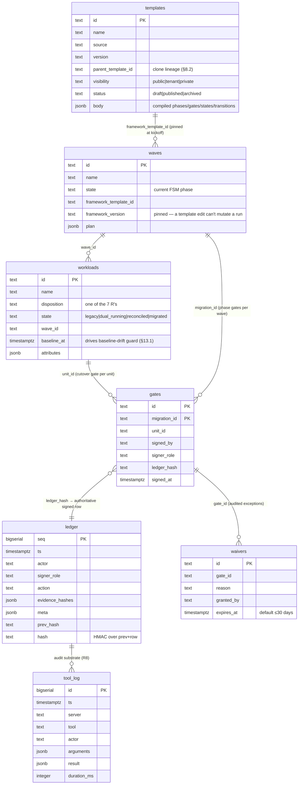

Notes:
- **Pinning** — `waves.framework_version` is set at kickoff so editing a template cannot mutate an in-flight run (white-paper §8.2 backward-compat).
- **The `gates` table is a projection**; the **authoritative record is the signed `ledger` row** (`gate.js` writes the ledger first, then the projection).
- **`waivers`** are themselves audited (second-line control); Invariants 1/5/6 are **non-waivable** (white-paper §12.4, App G: VG-01/05/07/10/14/15 are engine-enforced & non-waivable).
- **StateStore** abstracts all of this: `MemoryStateStore` (zero-dependency, `STATE_STORE=memory`) and `PgStateStore` (parameterised SQL only) in `src/db/statestore.js` (BUILT). Selection is `createStateStore(config, pool)` driven by `config.STATE_STORE` (env `VOSJ_STATE_STORE`, defaulting to `pg` when DB is configured, else `memory`).

---

## §11 UI surfaces  *(BUILD-PENDING — `src/ui/`)*

CE ships a static, vanilla-JS, fetch-only UI (no framework, no CDN — carrying the *spirit* of Luca UI Golden Rule 3 into the standalone repo). Three surfaces, all reading the engine facade via the REST API (§2.1):

| Surface | Purpose | Backing reads |
|---|---|---|
| **Command Center** | Single control page: waves, current phase state, valid next states, gate sign-off actions, 7-R disposition board. | `engine.machineFor`, `listValidNextStates`, `classify`, `StateStore` |
| **Live infra view** | The AKS-on-Azure-Local fabric: devstation pods, MCP order queue depth, PG/ledger health, recent tool-calls. | `/health`, `counts()`, `vosj.tool_log` |
| **Console / ledger explorer** | Append-only ledger browser with chain-verify status, waiver register, exportable evidence package (VG-26). | `ledger.list`, `ledger.verifyChain`, `vosj.waivers` |

UI standards carried over (spirit, not literal Luca Shell binding — §14): search/filter/pagination on list screens, skeletons while loading, `esc()` on all user-generated DOM content (XSS), responsive `@media max-width 768px`, dark default. The four diagrams already authored as inline SVG in the CE program site (`flow`, `seam`, `aks`, `loop`) are the visual source for these screens and are restated as the mermaid diagrams in §2, §4, §6, and (loop) §13.

---

## §12 Devstation fleet — CE substrate vs EE managed AI

A **devstation** (white-paper §10) is an autonomous sandboxed software-engineering agent that behaves like a human engineer's workstation. **What ships in CE:** the devstation *substrate* — in-cluster IDE/agent pods under a **hardened RuntimeClass** (gVisor / Kata / Firecracker microVM), each with its **own identity**, **own repository clone**, **own model credential (the operator's own seat — BYO-AI)**, **own source-control credential**, and a **worker loop** that claims orders from the durable queue (§6) and reports back.

**Isolation is a correctness requirement (white-paper §10 callout):** *one station = one identity = one clone = one account; commit-via-PR is the only cross-station path* — a shared working tree silently stomps. The fleet roles (architect, builder, reviewer, tester, migrator, fixer, deployer) **enforce separation of duties** (builder ≠ reviewer ≠ approver), which is how Invariants 2 and 3 are realised operationally.

**Credential brokering (white-paper §10.4):** long-lived secrets do **not** live in the execution pod — a broker/sidecar vends short-lived, audience-scoped, per-task credentials (workload-identity federation / SPIFFE-style OIDC for the model seat; short-TTL tokens for source control). The claim is *per-identity segmentation with minimised standing credentials* — explicitly **not** a claim of full isolation between code execution and credentials.

**The CE↔EE boundary (project mandate + white-paper §11):**

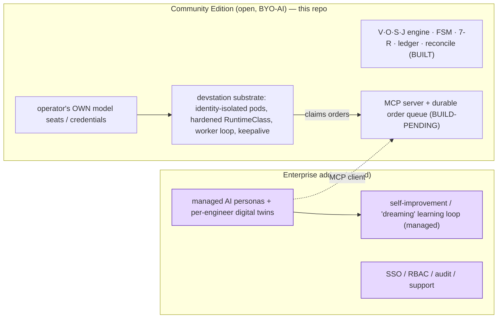

**The plumbing is open; the AI brain is the add-on.** The fleet *substrate* (pods, isolation, worker loop, queue) is CE; the *managed AI labour + twins + learning loop* are EE. CE operators bring their own model seats and drive the same MCP/queue fabric by hand or with their own client.

---

## §13 CI/CD & DevOps 365° assessment

The companion assessment (white-paper §17) closes the customer's CI/CD loop (scan → build → test → quality gates → security → release → deploy → provision/promote → operate → observe → feedback), scored against a weighted master checklist, a 5-level maturity model, and **DORA** targets. In Vosj it is delivered through an `AssessmentProvider` (`src/contracts/index.js`, BUILT) and plugs into the stations:

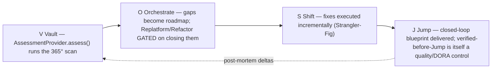

The disposition engine wires this in code: Replatform/Refactor carry `deliverySystemPrecondition: true` (§5), so the planning gate cannot select them until the 365° gaps are closed (white-paper §7.1/§17). Remediation agents (bug-crusher / healing-agent class) close gaps; the fleet auto-collects scorecard evidence.

---

## §14 Engineering standards — which Luca Golden Rules apply

CE is its **own codebase**, not Luca Express, so the Luca Golden Rules are **not literally binding**. The white paper (§14.3) maps the *spirit* 1:1; this is the explicit applicability statement for the standalone repo:

| Luca Golden Rule | Applies to CE? | How CE honours it |
|---|---|---|
| 1. LLM via `token-engine.js` | **Spirit only** | CE is BYO-AI; a single bridge/MCP seam, no direct provider SDK baked into the engine. |
| 2. DB via `aios-core-db` facade | **Spirit** | All DB access via `src/db/pool.js` parameterised `query()` + `PgStateStore` — **NEVER** string-concatenated SQL (BUILT). |
| 3. AIOS Shell UI | **No (own shell)** | CE ships its own vanilla-JS/fetch UI (`src/ui/`, BUILD-PENDING); no React/Vue/jQuery/CDN (spirit kept). |
| 4. `requireAuth` / `requireCapability` | **Yes** | `config.AUTH_MODE` = `token` by default (`open` only for localhost dev); auth on every data route, capability on every mutation (`src/auth/`, BUILD-PENDING). |
| 5. Config-driven, zero hardcoding | **Yes** | `src/config.js` reads env once, freezes; fail-closed secrets have **no default** (BUILT). |
| 6. Data isolation | **Yes (engine-level)** | StateStore is the isolation boundary; per-tenant filtering is an EE concern, not CE. |
| 7. Conventional Commits | **Yes** | repo convention. |
| Files < 300 lines / functions < 30 lines | **Yes** | every BUILT file is well under 300 lines. |
| Response envelope `{ ok, ... }` / `{ ok:false, error }` | **Yes** | the connector/verify/reconcile/health shapes already follow it (BUILT). |
| Health returns REAL metrics | **Yes** | `engine.counts()` returns live workload/wave counts; `ledger.healthy()` runs `verifyChain()` (BUILT). |

---

## §15 Build sequence

| Phase | Deliverable | Status |
|---|---|---|
| B0 | Contracts, config, schema, ledger, engine (template/FSM/7-R/gate/reconcile), demo connector, CAF template | **BUILT** |
| B1 | `src/server.js` Express bootstrap + `/health` (engine.counts + ledger.healthy + store.health) | BUILD-PENDING |
| B2 | `src/auth/` token/open middleware; `requireAuth`/`requireCapability` helpers | BUILD-PENDING |
| B3 | `src/api/` REST over the engine facade (templates, workloads, waves, classify, sign-transition, reconcile, ledger, verify-chain) | BUILD-PENDING |
| B4 | `src/mcp/` MCP server (stdio + Streamable HTTP, OAuth 2.1 RS / RFC 8707) + durable order queue table + claim logic | BUILD-PENDING |
| B5 | `src/ui/` Command Center, live infra view, ledger/console | BUILD-PENDING |
| B6 | `test/` node:test suites: invariant tests (no self-sign, fail-closed key, verified-before-cutover, drift guard), chain-verify, FSM transitions, 7-R no-big-bang | BUILD-PENDING |
| B7 | `deploy/` Helm chart + container image for AKS-on-Azure-Local (MetalLB IPAddressPool, ingress-nginx, CNPG, custom SSD storage class, external HMAC key) | BUILD-PENDING |

The Formation gate (CLAUDE.md) is explicit: **no code is "done" until it has gone through change-management + the CD/CI-CD release process**, and the suite's PhD Senior-Engineer review (IMPLEMENTATION-PLAN appendix) must sign off before B-phase work that is gated on it proceeds.

---

## §16 Open questions

- **Q1 — License reconciliation — RESOLVED (2026-06-23).** CE is **Apache-2.0**, aligned across `package.json`, `LICENSE`, `NOTICE`, and the CE site (EN/FR/DE/ES/PT). The earlier AGPL-3.0-only-vs-BSL-1.1 mismatch is closed; COST-MODEL's open-core funnel and PURPOSE's posture now key off Apache-2.0 (permissive + explicit patent grant). (Owner: Gustavo Assuncao / Gus IT LLC.)
- **Q2 — Order-queue table.** §6 specifies a DB-backed durable queue with atomic claim, but `schema.sql` does not yet contain the queue table. IMPLEMENTATION-PLAN must add it (`[ASSUMPTION]`: `vosj.orders` with `SELECT … FOR UPDATE SKIP LOCKED`).
- **Q3 — Three-way in-flight reversal.** White-paper §13.2 requires three-way authorisation for in-flight contingency reversal; `gate.js` enforces single-role signing today. The multi-signer gate variant is unbuilt.
- **Q4 — Waiver enforcement.** The `vosj.waivers` table exists, but the engine does not yet *consult* it when a gate criterion fails; wiring (and the non-waivable Inv. 1/5/6 block) is BUILD-PENDING.
- **Q5 — RBAC capability model.** `{domain}:{resource}:{action}` capabilities (white-paper §12.1) are referenced on the gate (`gate.capability`) but no capability table/middleware exists yet (`src/auth/`, BUILD-PENDING).
- **Q6 — "Express" template.** White-paper §22/§23 notes a future lightweight template for single-VM lift — explicitly **must still keep verified-before-cutover** (cannot drop the injected gate). Out of scope for v1; future work.
- **Q7 — Multi-template provenance UI.** Clone lineage (`templates.parent_template_id`) and diff-vs-parent (white-paper §8.3) are in the data model but have no UI; BUILD-PENDING.

---

*Cross-references: CORE-IDEA.md (essence, motto, editions split, non-negotiables) · PURPOSE.md (who it serves, success signals, what it is NOT) · COST-MODEL.md (open-core funnel economics) · IMPLEMENTATION-PLAN.md (phased plan, end-to-end test use case, Research Foundations + PhD sign-off) · DEPLOYMENT.md (AKS-on-Azure-Local runbook) · IMPLEMENTATION-TRACKER.csv (one row per step, prefix `T-VOSJCE-…`).*
