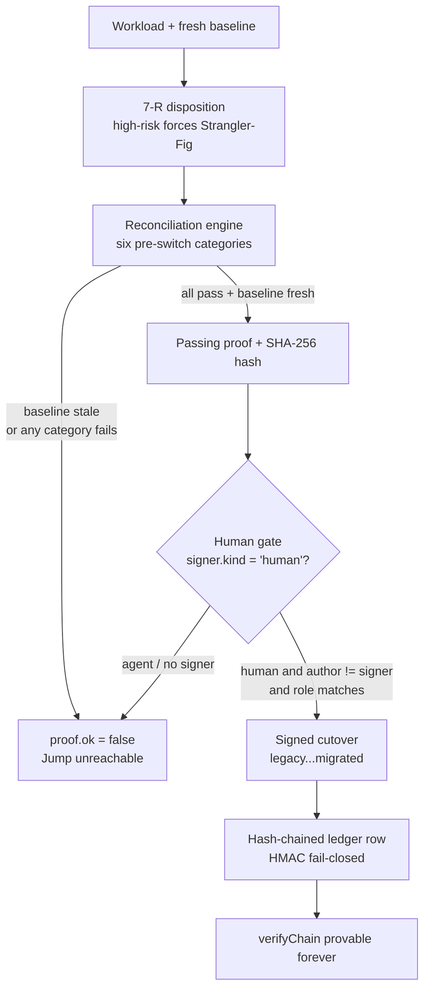

# Vosj Concepts — Stations, Dispositions, and the Invariants You Cannot Turn Off

> **Audience:** an operator or engineer *using* Vosj Community Edition to run a real
> migration. This guide explains the model you are operating inside — the four
> stations, the 7‑R disposition, and the five non‑negotiable invariants — and
> *why* each one is built the way it is. Everything below is grounded in the
> engine source (`src/engine/*.js`), the flagship template
> (`templates/caf.json`), and the configuration surface (`src/config.js`,
> `.env.example`).
>
> **Sibling guides:** start with [`01-getting-started.md`](01-getting-started.md)
> to install and boot; use [`03-running-a-migration.md`](03-running-a-migration.md)
> for the step‑by‑step API walkthrough; see
> [`04-writing-connectors.md`](04-writing-connectors.md) when you need a connector
> that can actually prove equivalence.

---

## 1. The mental model: a migration is an assembly line, not a project

Most application migrations are bespoke one‑offs: a manual runbook, tribal
knowledge, a "big‑bang" weekend cutover, and no proof afterward that the new
system behaves like the old one. Vosj replaces that with a **factory**: a
workload travels through four **stations**, each station ends in a **human‑signed
gate**, and **no cutover can happen until equivalence is mathematically proven**.

The brand letters **are** the engine — **V·O·S·J**:

| | Station | What it does for *you* | Exit gate (and who signs) |
|---|---------|------------------------|----------------------------|
| **V** | **Vault** | Discover, baseline, and decide. Inventory + dependency graph, performance/error baselines, and a **7‑R disposition** for every workload. | *Discovery sign‑off* — `director` |
| **O** | **Orchestrate** | Plan the wave. Transition architecture, data‑migration method, the **cutover runbook**, and an **independently authored rollback runbook**; build and freeze the landing zone. | *Planning sign‑off* — `director`; then *Execution freeze* — `infosec` |
| **S** | **Shift** | Migrate **incrementally**. Strangler‑Fig parallel run: old and new serve together while each unit moves `legacy → dual_running → reconciled`. | *Go / No‑Go* (full panel) — `director` |
| **J** | **Jump** | Cut over and verify. Reconciliation produces an **equivalence proof**; only then can a unit reach `migrated`, after which the source is decommissioned. | **Verified‑before‑Jump** — `dba`, *mandatory & non‑removable* |

In the flagship **Cloud Adoption Framework** template (`templates/caf.json`)
these four stations are compiled into **seven gated phases P1–P7**, each carrying
the `station` letter it belongs to:

| Phase | Name | Station | Gate id | Default signer |
|-------|------|---------|---------|----------------|
| P1 | Envision | V | `g-discovery-signoff` | `director` |
| P2 | Examine | V | `g-kickoff-complete` | `it-lead` |
| P3 | Engineer the Plan | O | `g-planning-signoff` | `director` |
| P4 | Establish Readiness | O | `g-execution-freeze` | `infosec` |
| P5 | Shift / Execute | S | `g-go-no-go` | `director` |
| P6 | Verify & Optimize | J | `g-reconciliation-pass` | `dba` *(cutover gate)* |
| P7 | Jump to BAU & Learn | J | `g-completed-archived` | `director` |

You can list this for yourself once Vosj is running:

```bash
curl -s -H "Authorization: Bearer $VOSJ_AUTH_TOKEN" \
  http://localhost:8080/api/templates/caf | jq '.template.phases[] | {id, name, station, gate: .gate.id, signer: .gate.signerRole}'
```

> **Why two FSMs?** Vosj runs *two* finite state machines at once
> (`src/engine/state-machine.js`): the **phase machine** (the template's
> `P1…P7`, gated at every phase exit) and the **unit lifecycle**
> (`legacy → dual_running → reconciled → migrated`). The phase machine is how a
> *wave* progresses; the unit lifecycle is how a *single workload* cuts over. The
> last unit step — `reconciled → migrated` — is the actual cutover and is
> governed by an **engine‑injected, non‑removable gate** (see §4.1).

---

## 2. The four stations in detail

### V — Vault: discover, baseline, decide

Vault answers three questions: *what do we have, how does it behave today, and
what are we going to do with each piece?* The deliverables in the template
(P1–P2) are a business case, a readiness report, an **application‑centric
inventory**, a **dependency DAG** (which must be acyclic), **performance/error
baselines**, and — the decision that drives everything downstream — a **7‑R
disposition for every in‑scope workload** (see §3).

Two of these are load‑bearing for invariants you cannot escape later:

- The **baseline** (`baseline_at` / `baselineAt` on a workload) is timestamped
  here. The Jump station will *reject* an equivalence proof taken against a stale
  baseline (the **baseline‑drift guard**, §4.5). A baseline is not a formality —
  it is the reference point the cutover proof is measured against.
- The **disposition** decides the cutover *style*. A high‑risk disposition
  (Refactor, Replatform, Relocate) **forces** Strangler‑Fig — there is no
  big‑bang plan to choose, by construction (§3.2).

**The human gate (`g-discovery-signoff`, signer `director`):** a `director`
signs that the business case is approved, readiness is assessed, and a target
platform is chosen. The P2 gate (`g-kickoff-complete`, signer `it-lead`) further
requires that *every in‑scope workload carries a disposition* and the dependency
sort is acyclic.

### O — Orchestrate: plan the wave and freeze

Orchestrate turns decisions into an executable, reversible plan. The template
phases P3–P4 produce the **transition architecture**, the **data‑migration
method**, a **cited cutover runbook**, and — critically — an **independently
authored rollback runbook** (separate author and context). It then **builds the
landing zone**, runs a **baseline‑drift check**, and **freezes** infra and app
changes.

**Why an independent rollback author?** This is *separation of duties* applied to
planning: the person who wrote how to go forward is not the person who wrote how
to come back. The same principle is enforced *structurally* at every gate (§4.3).

**The human gates:** P3 `g-planning-signoff` is signed by a `director` and
requires runbook citations resolved, rollback authored independently, tabletops
passed, and four‑eyes validation complete. P4 `g-execution-freeze` is signed by
`infosec` and requires baseline drift within window, infra/app frozen, and
vendors verified.

### S — Shift: migrate incrementally (Strangler‑Fig)

Shift is where data and traffic actually move — but **never all at once for a
high‑risk workload**. In a Strangler‑Fig run the old system and the new system
serve **in parallel** while each unit advances through the lifecycle. The
conductor steps the runbook calling executors via the connector contract, every
step's evidence is hashed, and contingency monitoring is armed.

A unit's lifecycle is strictly forward, **one step at a time** — the engine will
not let you skip:

```
legacy → dual_running → reconciled → migrated
```

`canUnitTransition()` enforces `j === i + 1`: you cannot jump from `legacy`
straight to `migrated`, and you cannot move backward through this API.

**The human gate (`g-go-no-go`, signer `director`):** a *full panel* go/no‑go
decision with contingency monitoring armed. Shift is also where the
"`dual_running`" state earns its name — both systems are live, so a failed unit
can be abandoned without customer impact.

### J — Jump: cut over and verify (the irreversible step, made safe)

Jump is the only station that performs the irreversible act — decommissioning the
source — and it is the most heavily guarded. The lifecycle's final transition,
`reconciled → migrated`, is the cutover. Before it can fire, the
**reconciliation engine** (`src/engine/reconcile.js`) must produce a **passing
equivalence proof** `π(w)`.

Reconciliation compares the migrated target against the source across six
**pre‑switch categories** — these are hard gates:

```
replication_lag · row_counts · checksums · sequence_identity · constraints · smoke
```

Any pre‑switch category that is **not reported as `ok`** is treated as a failure
(*"not reported (fail‑closed)"*). Performance/plan parity is assessed
**post‑cutover** in P6's revocable window, so it is informational here, not a
pre‑switch blocker.

The proof is a self‑describing object with a SHA‑256 `hash`. The cutover gate
binds **that exact hash** — so the human who signs is signing a specific,
reproducible proof, not a vague "looks good."

**The human gate (`g-reconciliation-pass` / `engine.verified-before-jump`,
signer `dba`, `cutover: true`):** the one gate you cannot delete, reorder, or
satisfy with an agent (§4.1, §4.2). The P6 gate is *revocable within 30 minutes*
on observed drift; P7 (`g-completed-archived`, `director`) confirms return to
BAU and that the source was decommissioned **after** the retention window.

You run reconciliation through the API:

```bash
curl -s -X POST http://localhost:8080/api/reconcile \
  -H "Authorization: Bearer $VOSJ_AUTH_TOKEN" \
  -H "Content-Type: application/json" \
  -d '{"workloadId":"wl-billing-db","connector":"demo"}' | jq '{proofOk, baselineFresh, categories: [.categories[] | {name, ok}], hash: .proof.hash}'
```

`proofOk` is `true` **only** when the connector said `ok`, **and** every
pre‑switch category passed, **and** the baseline is fresh. That `proof` object is
what you then pass into the signed cutover transition.

---

## 3. The 7‑R disposition: deciding what happens to each workload

Every in‑scope workload gets exactly one of seven dispositions. In Vosj a
disposition is **not a label** — it is a **typed contract** that fixes four
things at once (`src/engine/disposition.js`):

```
<executorClass, runbookTemplate, reconciliationProfile, cutoverStyle>
```

The `cutoverStyle` is the consequential one: it is either `big-bang`,
`strangler-fig`, or `none`, and **you do not get to override it per run**.

### 3.1 The seven dispositions and when each applies

| Disposition | Meaning | When to choose it | Cutover style | High‑risk? |
|-------------|---------|-------------------|---------------|------------|
| **Retire** | Decommission; no migration. | The workload is end‑of‑life or being switched off. | `none` | no |
| **Retain** | Keep at source (regulatory/technical hold). | A regulatory hold or hard technical constraint means it must stay where it is. | `none` (split‑environment) | no |
| **Rehost** | Lift‑and‑shift to IaaS. | Move the VM/app as‑is; no reshaping. | `big-bang` | no |
| **Relocate** | Move the hypervisor wholesale (e.g. on‑prem virtualization → cloud‑hosted). | You're moving the platform under the workload, not the workload itself. | **`strangler-fig`** *(enforced)* | **yes** |
| **Repurchase** | Drop‑and‑shop to SaaS. | Replace the app with a SaaS product; extract data and cut over. | `big-bang` | no |
| **Replatform** | Lift‑and‑reshape (e.g. to a managed database). | Keep the app but adopt a managed service underneath. | **`strangler-fig`** | **yes** |
| **Refactor** | Re‑architect cloud‑native. | Substantially rewrite for the cloud. | **`strangler-fig`** *(big‑bang unavailable)* | **yes** |

You can set the disposition explicitly on a workload (`disposition` field), or
let the conservative heuristic classify it from workload attributes
(`heuristic()` in `disposition.js`):

| Attribute on the workload | Heuristic result |
|---------------------------|------------------|
| `decommission` / `endOfLife` | Retire |
| `mustStaySource` / `regulatoryHold` | Retain |
| `saasReplacement` | Repurchase |
| `cloudNativeRewrite` | Refactor |
| `managedServiceTarget` | Replatform |
| `hypervisorMove` | Relocate |
| *(none of the above)* | Rehost |

Inspect the classification for any saved workload:

```bash
curl -s -H "Authorization: Bearer $VOSJ_AUTH_TOKEN" \
  http://localhost:8080/api/classify/wl-billing-db | jq '.classification | {disposition, strangler, bigBangAvailable, cutover: .contract.cutoverStyle}'
```

The response tells you, per workload, whether `strangler` is forced and whether
`bigBangAvailable` is `false`.

### 3.2 Why Strangler‑Fig is *forced* for high‑risk work

This is the property that protects you most. For **Refactor**, **Replatform**,
and **Relocate**, the contract table hard‑codes `cutoverStyle: 'strangler-fig'`.
Because `classify()` reads `cutoverStyle` straight from the contract, the result
exposes `bigBangAvailable: false` for those dispositions — **a big‑bang plan is
structurally unavailable**.

> **The guarantee is not in the guess.** Even the heuristic cannot produce a
> big‑bang plan for a high‑risk reshape. The safety comes from the *contract
> table*, not from any classifier being clever. A re‑architecture or a managed‑DB
> move is exactly where a single‑shot cutover does the most damage and is hardest
> to reverse — so Vosj removes that option entirely rather than trusting a human
> to decline it under deadline pressure.

Two of these (Replatform, Refactor) additionally carry
`deliverySystemPrecondition: true` — a working CI/CD ("365° delivery readiness")
is a *hard dependency* before the disposition can proceed, because you cannot run
an incremental, reversible cutover without an automated delivery system to drive
it.

---

## 4. The five non‑negotiable invariants (and why they protect you)

These are not configuration. They are **structural guarantees** enforced in the
engine code, and they are deliberately placed where a template author, an API
caller, or an AI agent cannot reach them. The waiver subsystem
(`src/engine/waiver.js`) names all five on a reserved `HARD_INVARIANT_CHECKS`
list and **refuses to waive any of them** — a waiver can only ever soften an
*advisory* check, never a hard invariant.

### 4.1 Verified‑before‑Jump — a non‑verified cutover is unreachable

**What it means:** a unit cannot reach `migrated` without a **passing
reconciliation proof**. The cutover gate is *injected by the engine into every
template* and **cannot be removed** by any template:

- `state-machine.js` defines `INJECTED_CUTOVER_GATE`
  (`id: 'engine.verified-before-jump'`, `signerRole: 'dba'`, `cutover: true`),
  always made addressable on every template by `indexTemplate()`.
- `cutoverUnit()` fails closed: *"cutover fail‑closed: passing reconciliation
  proof required"* if `proof.ok !== true`.
- `gate.js` independently re‑checks it: a gate with `cutover` or `requiresProof`
  is rejected unless `proof.ok === true` **and** `proof.hash` exists.

**Why it protects you:** the worst migration failures are silent — the cutover
"succeeds," traffic moves, and three days later you discover the new database is
missing 0.3% of rows. Vosj makes that class of failure *impossible to reach by
accident*: there is no code path to `migrated` that does not first carry a proof
whose hash the signer endorsed. The proof covers row counts, checksums, sequence
identity, constraints, replication lag, and a smoke test — the categories where
silent divergence hides.

### 4.2 No agent self‑sign — humans approve, machines execute

**What it means:** a gate signature is only valid if `signer.kind === 'human'`.
This is enforced in `GateSigner.assertHumanIndependent()`
(`src/contracts/index.js`) and called by `HumanGateSigner.sign()`. The REST layer
*cannot* grant the signature: an authenticated API caller is deliberately an
`agent` principal (`src/api/auth.js`), and the human signer identity must be
supplied **explicitly in the request body** and validated by the engine.

**Why it protects you:** Vosj is AI‑native — agents drive the factory. This
invariant is the line between *automation* and *abdication*. An agent can do all
the work; it can never **authorise** the irreversible step. The accountability
for a cutover always lands on a named human in a named role.

### 4.3 Separation of duties — the author can never approve their own work

**What it means:** even a human signature is rejected if the signer is the same
identity as the work's author: `assertHumanIndependent()` throws *"author cannot
self‑sign (separation of duties)"* when `gate.actor === signer.id`. The gate
engine additionally enforces **role**: if the gate names a `signerRole`, the
signer's `role` must match it (e.g. the cutover gate demands a `dba`).

**Why it protects you:** this is the classic four‑eyes control. The person who
built the migration step has every incentive to believe it works; an independent
approver does not. Combined with the independently authored rollback runbook
(§2, Orchestrate), it means no single person can both plan *and* bless an
irreversible change.

### 4.4 Tamper‑evident ledger — every decision is provable after the fact

**What it means:** every gate signature, cutover, and waiver use is appended to a
**hash‑chained, HMAC‑SHA256 ledger** (`src/ledger/ledger.js`). Each row's `hash`
is computed over `prevHash + canonical(row)` using an **externally custodied
signing key** (`VOSJ_LEDGER_HMAC_KEY`). The key is **fail‑closed**: if it is
absent, `append()` *throws* — it **never** falls back to a default key. The chain
is independently verifiable: `verifyChain()` walks the chain and returns the
`seq` of the first row whose `prevHash` link or HMAC does not recompute, so any
forge or back‑date is detectable.

Verify the chain yourself at any time:

```bash
curl -s -H "Authorization: Bearer $VOSJ_AUTH_TOKEN" \
  http://localhost:8080/api/ledger/verify | jq    # -> { "ok": true, "verified": true, "brokenAt": null }

curl -s -H "Authorization: Bearer $VOSJ_AUTH_TOKEN" \
  http://localhost:8080/api/ledger | jq '.entries[] | {seq, ts, action, actor, signerRole, hash: .hash[0:12]}'
```

**Why it protects you:** an auditor (or a future you, during an incident
post‑mortem) can prove *who* signed *what* gate, against *which* proof hash, and
*when* — and can prove the record was not edited afterward. Because the key lives
outside the database (KMS/HSM/vault), someone with database write access still
cannot silently rewrite history. Generate the key with `openssl rand -hex 32` and
custody it externally — see [`01-getting-started.md`](01-getting-started.md).

> **Operator note:** because the ledger is fail‑closed, a missing
> `VOSJ_LEDGER_HMAC_KEY` does not produce an unsigned migration — it produces a
> migration that *cannot proceed at all*. That is by design: no key means no
> provable record, and Vosj would rather stop than record something it cannot
> later prove.

### 4.5 Baseline‑drift guard — you cannot prove equivalence against a stale baseline

**What it means:** the reconciliation engine treats an out‑of‑date baseline as a
failure. `isFreshBaseline()` (`src/engine/reconcile.js`) returns `false` when the
workload has **no** `baselineAt` (fail‑closed) or when it is older than
`baselineMaxAgeMs` (default **24h**, configurable via `VOSJ_BASELINE_MAX_AGE_MS`).
The overall `proof.ok` is `false` unless `baselineFresh` is `true`, so a stale
baseline cannot yield a passing proof — and therefore cannot satisfy
Verified‑before‑Jump.

**Why it protects you:** an equivalence proof is only meaningful relative to a
known starting point. If the source system kept changing after you measured it,
"the target matches the baseline" tells you nothing about whether the target
matches *reality*. The guard forces you to re‑baseline a long‑running migration
before cutover, so the proof you sign is against current truth, not week‑old
truth.

---

## 5. How the invariants compose into one guarantee

Read together, the five invariants close the loop:



The practical upshot for you as an operator: **the only way to cut a workload
over is to (1) have a fresh baseline, (2) pass all six reconciliation categories,
(3) get an independent human in the right role to sign the specific proof hash,
and (4) have a custodied ledger key to record it.** Remove any one and the system
fails closed — it stops, it does not improvise. That is the entire point of
Vosj: the safe path is the *only* path.

---

## 6. Where these concepts show up in the API

| Concept | Endpoint / call | Capability required |
|---------|------------------|---------------------|
| List the framework template & its gated phases | `GET /api/templates`, `GET /api/templates/:id` | *(auth only)* |
| Register a workload (with its baseline) | `POST /api/workloads` | `migration:workload:write` |
| See a workload's 7‑R classification | `GET /api/classify/:workloadId` | *(auth only)* |
| Sign a phase gate transition (P1→P2…) | `POST /api/waves/:id/transition` | `migration:gate:sign` |
| Produce the equivalence proof | `POST /api/reconcile` | `migration:reconcile:run` |
| Read / verify the tamper‑evident ledger | `GET /api/ledger`, `GET /api/ledger/verify` | *(auth only)* |

The full capability set is fixed in `src/api/auth.js` (`CE_CAPABILITIES`):
`migration:workload:write`, `migration:disposition:write`, `migration:wave:write`,
`migration:wave:plan`, `migration:wave:shift`, `migration:reconcile:run`,
`migration:gate:sign`, `migration:jump:execute`. Note that **holding
`migration:gate:sign` lets you *submit* a transition — it does not make you the
signer.** The human signer (`signer.id`, `signer.kind`, `signer.role`) is carried
in the request body and validated by the engine's `HumanGateSigner`, exactly so
that the capability layer can never become a backdoor around §4.2 and §4.3.

For the end‑to‑end walkthrough — register a workload, classify it, plan the wave,
reconcile, and sign the cutover — continue to
[`03-running-a-migration.md`](03-running-a-migration.md). To build a connector
whose `verify()` produces a real proof (the whole reason the invariants have
teeth), see [`04-writing-connectors.md`](04-writing-connectors.md).
