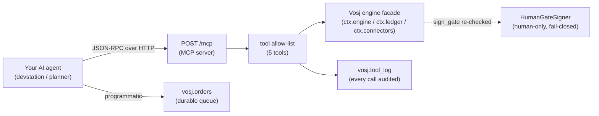
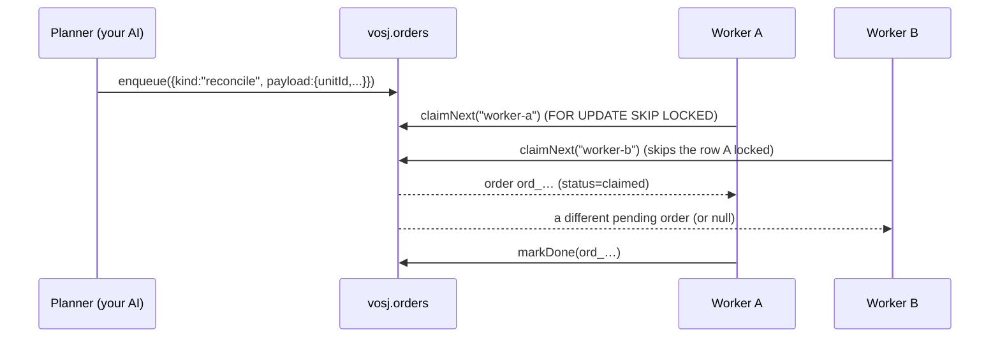

# 04 — Drive Vosj with your own AI (MCP + the order queue)

> **Audience:** an operator/engineer who wants *their* AI agent — a Claude Code
> devstation, a Copilot/Cursor session, an internal planner, anything that speaks
> the [Model Context Protocol](https://modelcontextprotocol.io) — to drive the Vosj
> migration factory. Vosj Community Edition (CE) is **bring-your-own-AI**: the
> server ships *no* model and *no* persona; it exposes a JSON-RPC tool seam and a
> durable work-order queue, and you point your own agent at them.
>
> **Sibling guides:** [`01-getting-started.md`](01-getting-started.md) ·
> [`02-templates-and-waves.md`](02-templates-and-waves.md) ·
> [`03-reconcile-and-gates.md`](03-reconcile-and-gates.md) ·
> [`05-connectors.md`](05-connectors.md). For deployment see
> [`../DEPLOYMENT.md`](../DEPLOYMENT.md); for the architecture rationale see
> [`../DESIGN.md`](../DESIGN.md).

---

## 1. What an agent can — and cannot — do

The bring-your-own-AI seam is built on a hard separation of duties, and the seam
**cannot loosen it**. An agent authenticates as an `agent` principal and may
*exercise* engine capabilities (classify, reconcile, list, verify). It can even
*submit* a gate sign-off — but the engine refuses to record one unless the signer
in the payload is a **human** distinct from the step's author. This is Invariant 1
("no agent self-sign") and it is enforced in the engine's `HumanGateSigner`, not in
the MCP layer (`src/mcp/server.js` line 8–9, `src/mcp/tools.js` line 76–87). No
configuration, token, or tool call can grant an agent the right to sign its own
cutover.

So in practice your AI can do the *thinking and the legwork* — discovery,
classification, running reconciliation, checking the ledger, queueing the next
unit of work — and a human stays on the gate.



---

## 2. The MCP endpoint

The MCP server is mounted at a single route:

| Property | Value |
|---|---|
| **Endpoint** | `POST /mcp` |
| **Transport** | Streamable HTTP — one POST carries the JSON-RPC request, the JSON response comes back in the same HTTP response. **No legacy SSE stream.** |
| **Protocol version** | `2025-06-18` (advertised in the `initialize` result) |
| **Server info** | `{ name: "vosj-mcp", version: <package version> }` |
| **Auth** | Reuses the REST bearer middleware (`requireAuth`) — see [§4](#4-authentication). |
| **Session header** | `Mcp-Session-Id` — issued on `initialize`, echoed on every later response. Honoured but **not required** in CE. |

The server speaks **JSON-RPC 2.0**. Every request is a single object (batches are
rejected) with `jsonrpc: "2.0"`, a string `method`, an optional `params`, and an
`id`. It implements exactly three methods:

| Method | Purpose |
|---|---|
| `initialize` | Handshake — returns protocol version, capabilities, and `serverInfo`. |
| `tools/list` | Returns the tool catalog with JSON Schemas so a planner can call correctly. |
| `tools/call` | Invoke one allow-listed tool by `name` with `arguments`. |

Anything else returns JSON-RPC error `-32601` (method not found).

> **Note on HTTP status:** the MCP server **always returns HTTP `200`** for a
> well-formed transport request, even when the JSON-RPC envelope carries an
> `error` object or a tool fails. Inspect the JSON body, not the HTTP status, to
> tell success from failure (`src/mcp/server.js` lines 105–114). HTTP `401`/`503`
> come only from the auth layer *before* dispatch.

---

## 3. The handshake (`initialize`)

Start every session with `initialize`. Capture the `Mcp-Session-Id` response
header and send it back on subsequent calls.

```bash
VOSJ_URL=http://localhost:8080
TOKEN=your-strong-bearer-token   # = VOSJ_AUTH_TOKEN on the server

curl -sS -D - "$VOSJ_URL/mcp" \
  -H "Authorization: Bearer $TOKEN" \
  -H "Content-Type: application/json" \
  -d '{
        "jsonrpc": "2.0",
        "id": 1,
        "method": "initialize",
        "params": {
          "protocolVersion": "2025-06-18",
          "clientInfo": { "name": "my-devstation", "version": "1.0" }
        }
      }'
```

Response (headers include `Mcp-Session-Id: mcp_…`):

```json
{
  "jsonrpc": "2.0",
  "id": 1,
  "result": {
    "protocolVersion": "2025-06-18",
    "capabilities": { "tools": { "listChanged": false } },
    "serverInfo": { "name": "vosj-mcp", "version": "<x.y.z>" }
  }
}
```

`listChanged: false` means the tool set is fixed for the life of the server — your
agent can list once and cache.

---

## 4. Authentication

The MCP endpoint uses the **same** authentication as the REST API
(`src/api/auth.js`), so one credential drives both surfaces.

- **`token` mode (default, the only safe remote mode).** Set
  `VOSJ_AUTH_MODE=token` and `VOSJ_AUTH_TOKEN=<secret>` on the server. Every call
  must carry `Authorization: Bearer <secret>`. The token is compared in
  constant-time; a missing/wrong token returns JSON `{ "ok": false, … }` with HTTP
  `401`. If `token` mode is selected but **no** token is configured, the server
  fails closed with HTTP `503` (`authentication not configured: set
  VOSJ_AUTH_TOKEN`).
- **`open` mode — localhost dev only.** `VOSJ_AUTH_MODE=open` skips the token, but
  a **non-local** caller is still rejected with HTTP `401`. Never use `open` for a
  remote agent.

**Audit attribution.** An authenticated caller is an `agent` principal with id
`token-principal` by default. To label *which* of your agents made a call in the
audit log, send an `X-Vosj-Actor` header (truncated to 200 chars); its value
becomes the `actor` recorded on every `tools/call` (`src/api/auth.js` lines
137–146, written into `vosj.tool_log.actor`).

```bash
curl -sS "$VOSJ_URL/mcp" \
  -H "Authorization: Bearer $TOKEN" \
  -H "X-Vosj-Actor: claude-builder-3" \
  -H "Content-Type: application/json" \
  -d '{ "jsonrpc":"2.0","id":2,"method":"tools/list" }'
```

> The agent principal holds the CE capability set (workload/disposition/wave write,
> reconcile, gate-sign, jump-execute). Holding `migration:gate:sign` lets it
> *submit* a sign-off — but, again, the engine still requires a **human** signer in
> the payload (§6.3).

---

## 5. Listing the tools (`tools/list`)

```bash
curl -sS "$VOSJ_URL/mcp" \
  -H "Authorization: Bearer $TOKEN" \
  -H "Content-Type: application/json" \
  -d '{ "jsonrpc":"2.0","id":3,"method":"tools/list" }'
```

Returns the catalog — each entry has `name`, `description`, and a JSON-Schema
`inputSchema`. The set is an **explicit allow-list** (`src/mcp/tools.js`);
`tools/call` rejects any name not on it with error `-32601`.

| Tool | Mutating? | Required capability (in the engine) | Required arguments |
|---|---|---|---|
| `list_templates` | no | — | *(none)* |
| `classify_workload` | no | — | `workload` (object) |
| `run_reconcile` | runs a connector | reconcile capability | `unit` (object); `connector` (string, optional, default `demo`) |
| `sign_gate` | **yes** | gate-sign + **human** signer | `gate` (object), `signer` (object) |
| `ledger_verify` | no | — | *(none)* |

---

## 6. Calling the tools (`tools/call`)

A `tools/call` request takes `params.name` and `params.arguments`. The result is
wrapped in the MCP shape:

```json
{
  "content": [{ "type": "text", "text": "<the house envelope, JSON-stringified>" }],
  "isError": <true if the envelope's ok === false>,
  "structuredContent": { "ok": true, "...": "..." }
}
```

Read `structuredContent` (the parsed house envelope `{ ok: true, … }` /
`{ ok: false, error }`); `content[0].text` is the same object stringified, for
MCP clients that only render text. `isError` mirrors `structuredContent.ok ===
false` — note this is a *tool-level* failure, distinct from a JSON-RPC `error`
(which only fires for transport/method faults).

### 6.1 `list_templates`

Enumerate the migration framework templates (the V·O·S·J phases/gates). Useful for
an agent picking a framework for a new wave.

```bash
curl -sS "$VOSJ_URL/mcp" \
  -H "Authorization: Bearer $TOKEN" \
  -H "Content-Type: application/json" \
  -d '{ "jsonrpc":"2.0","id":4,"method":"tools/call",
        "params": { "name": "list_templates", "arguments": {} } }'
```

`structuredContent` →

```json
{
  "ok": true,
  "templates": [
    { "id": "caf", "name": "Cloud Adoption Framework (7-phase gated)",
      "version": "1", "source": "flagship", "description": "…",
      "phases": 7, "stations": ["V","V","O","O","S","J","J"] }
  ]
}
```

The flagship template is `caf` (`templates/caf.json`): seven gated phases `P1..P7`
mapped onto the four stations. The `Shift → Jump` cutover gate (phase `P6`,
`g-reconciliation-pass`, `cutover: true`) is the engine-injected
verified-before-Jump gate and needs a *passing equivalence proof*. See
[`02-templates-and-waves.md`](02-templates-and-waves.md).

### 6.2 `classify_workload`

Run the 7-R disposition engine on a workload and get back its typed contract. The
`workload` argument is a free-form object describing the unit (its attributes feed
the classifier).

```bash
curl -sS "$VOSJ_URL/mcp" \
  -H "Authorization: Bearer $TOKEN" \
  -H "Content-Type: application/json" \
  -d '{ "jsonrpc":"2.0","id":5,"method":"tools/call",
        "params": {
          "name": "classify_workload",
          "arguments": { "workload": { "id": "billing-api", "risk": "high" } }
        } }'
```

`structuredContent` →

```json
{
  "ok": true,
  "disposition": "…",
  "contract": { "...": "..." },
  "strangler": true,
  "bigBangAvailable": false
}
```

`bigBangAvailable: false` / `strangler: true` is the disposition engine refusing a
big-bang for a high-risk workload (a baked-in invariant). A missing or non-object
`workload` returns `{ "ok": false, "error": "workload object required" }`.

### 6.3 `sign_gate` — the human seam

Submit a gate sign-off. The `signer` **must** be a human identity, and the engine
re-validates separation of duties.

```bash
curl -sS "$VOSJ_URL/mcp" \
  -H "Authorization: Bearer $TOKEN" \
  -H "Content-Type: application/json" \
  -d '{ "jsonrpc":"2.0","id":6,"method":"tools/call",
        "params": {
          "name": "sign_gate",
          "arguments": {
            "gate": { "id": "g-go-no-go", "...": "..." },
            "signer": { "id": "alice@example.com", "kind": "human", "role": "director" }
          }
        } }'
```

On success `structuredContent` returns the ledger row produced by the signer:

```json
{ "ok": true, "ledger": { "seq": 42, "hash": "…", "action": "gate.sign", "ts": "…" } }
```

Fail-closed behaviour you must expect:

- `signer.kind !== "human"` →
  `{ "ok": false, "error": "sign_gate requires a human signer (no agent self-sign)" }`
  (rejected at the seam *before* the engine, `src/mcp/tools.js` line 82).
- Even with `kind: "human"`, the engine's `HumanGateSigner` still rejects the call
  if the signer equals the step's author, or — for a `cutover` gate — if there is
  no passing equivalence proof. Surface the returned `error` to your operator; do
  **not** retry by changing the signer kind.

The `signer` object is **redacted in the audit log** to `{ id, kind, role }` only
— no other signer fields are persisted (`src/mcp/tools.js` lines 130–137). Use the
REST route `POST /api/waves/:id/transition` (see
[`03-reconcile-and-gates.md`](03-reconcile-and-gates.md)) if you want the wave's
FSM state advanced as part of the same signed transition; `sign_gate` records the
gate signature itself.

### 6.4 `run_reconcile`

Run the verification/reconciliation engine for a unit via a connector and get back
the equivalence proof. `unit` is required; `connector` is the connector id (default
`demo`).

```bash
curl -sS "$VOSJ_URL/mcp" \
  -H "Authorization: Bearer $TOKEN" \
  -H "Content-Type: application/json" \
  -d '{ "jsonrpc":"2.0","id":7,"method":"tools/call",
        "params": {
          "name": "run_reconcile",
          "arguments": {
            "unit": { "id": "billing-db", "state": "dual_running", "baselineAt": "2026-06-20T00:00:00Z" },
            "connector": "demo"
          }
        } }'
```

`structuredContent` →

```json
{
  "ok": true,
  "proof": { "...": "the equivalence proof π(w)" },
  "categories": { "rowCount": "…", "checksum": "…" },
  "baselineFresh": true
}
```

`ok: false` here means the proof did **not** pass — e.g. `baselineFresh: false`
means reconciliation ran against a stale baseline and is rejected by the
baseline-drift guard. The default `connector` is `demo`; CE also ships `azure-arc`
and `hyperv` connectors that are contract-complete but **fail closed until wired**
(an unwired connector cannot produce a passing proof — see
[`05-connectors.md`](05-connectors.md)). An unknown id returns
`{ "ok": false, "error": "unknown connector: <id>" }`.

### 6.5 `ledger_verify`

Verify the tamper-evident, hash-chained audit ledger end to end. Take no
arguments.

```bash
curl -sS "$VOSJ_URL/mcp" \
  -H "Authorization: Bearer $TOKEN" \
  -H "Content-Type: application/json" \
  -d '{ "jsonrpc":"2.0","id":8,"method":"tools/call",
        "params": { "name": "ledger_verify", "arguments": {} } }'
```

`structuredContent` →

```json
{ "ok": true, "brokenAt": null }
```

If the chain has been tampered with, `ok` is `false` and `brokenAt` is the `seq`
of the first broken link. A good agent health-check is to call `ledger_verify`
after any sign-off and alert if `ok !== true`.

---

## 7. Every call is audited

Each `tools/call` is appended to **`vosj.tool_log`** — the audit substrate for all
external (bring-your-own-AI) interaction — with the tool name, the (redacted)
arguments, the result envelope, the `actor` (your `X-Vosj-Actor` header), and the
call duration. Auditing is best-effort and never blocks the call: if the append
fails, the server logs a `WARN` and still returns your result
(`src/mcp/tools.js` lines 104–127).

Inspect it directly (PG store), e.g.:

```sql
SELECT ts, tool, actor, (result->>'ok') AS ok, duration_ms
FROM vosj.tool_log
ORDER BY ts DESC
LIMIT 20;
```

The table is created by [`src/db/schema.sql`](../../src/db/schema.sql); apply the
schema with `npm run migrate` (or `psql`). With the in-memory store the log lives
in-process and is lost on restart — fine for evaluation, not for an audit of
record.

---

## 8. The durable order queue

`tools/call` is **synchronous** — the agent waits for each engine op. For
long-running or batched work (e.g. "reconcile all 40 units in wave-3, one at a
time"), Vosj ships a **durable work-order queue** backed by the **`vosj.orders`**
table (`src/mcp/queue.js`). The pattern is the classic producer/worker split:

- a **planner** (your AI) `enqueue`s orders;
- one or more **workers** each `claimNext` a pending order, do the work
  (typically by calling the same engine ops the tools wrap), then `markDone` /
  `markFailed`.



### 8.1 It is a library, not an HTTP route

> **Important — ground truth.** The order queue is a **programmatic module**. CE
> does **not** expose it over HTTP: there is no `/api/orders` route, and the MCP
> tool allow-list does **not** include a queue tool. You drive the queue from
> code — a small worker script, your devstation, or an Enterprise control plane —
> using `createQueue(ctx)`. (The MCP *tools* in §6 are the HTTP-exposed seam; the
> queue is the durable-batch seam beside it.)

### 8.2 Backends — picked automatically

`createQueue(ctx)` returns one of two implementations based on the configured
store (`src/mcp/queue.js` lines 16–20):

| Backend | When | Concurrency guarantee |
|---|---|---|
| `PgOrderQueue` | `STATE_STORE=pg` and the DB is configured | Atomic claim via `SELECT … FOR UPDATE SKIP LOCKED` inside a transaction — two concurrent workers **never** grab the same row, and no worker blocks on another's locked row. Survives restarts. |
| `MemoryOrderQueue` | `STATE_STORE=memory` (the in-memory fallback) | Single-process only; single-threaded JS makes claim atomic, but orders are lost on restart. Evaluation only. |

The store/`STATE_STORE` selection is driven by env — see
[`01-getting-started.md`](01-getting-started.md) and [`../DEPLOYMENT.md`](../DEPLOYMENT.md).

### 8.3 The order shape

`enqueue` normalises an order (`normaliseOrder`, lines 26–34):

| Field | Type | Notes |
|---|---|---|
| `id` | string | Auto-generated if omitted: `ord_<base36-time>_<hex>`. |
| `kind` | string | **Required.** A non-string/missing kind throws `order requires a string kind`. This is *your* verb — e.g. `"reconcile"`, `"classify"`. |
| `payload` | object | Optional; non-object payloads are coerced to `{}`. Put the work parameters here. |

A stored row also carries `status` (`pending` → `claimed` → `done` | `failed`),
`claimed_by`, `claimed_at`, `created_at`, `updated_at`. The `STATUS` constants are
exported from the module.

### 8.4 Methods

| Method | What it does |
|---|---|
| `enqueue(order)` | Insert a `pending` order; returns the stored row. |
| `claimNext(workerId)` | Atomically take the **oldest** `pending` order (by `created_at`), mark it `claimed` with `claimed_by = workerId`, and return it; returns `null` when the queue is empty. |
| `markDone(id)` | Set `status = done`; returns the row (or `null` if unknown). |
| `markFailed(id)` | Set `status = failed`; returns the row (or `null`). |
| `stats()` | A `{ status: count }` tally, e.g. `{ pending: 3, claimed: 1, done: 12 }`. |

### 8.5 A minimal worker

Drop a small Node script beside the app (it reuses the running `ctx`). Conceptual
shape:

```js
// my-worker.js — claim and process Vosj orders. Run alongside the server.
const { buildContext } = require('./src/server');
const { createQueue } = require('./src/mcp/queue');

(async () => {
  const ctx = await buildContext();         // { config, engine, store, ledger, connectors, log }
  const queue = createQueue(ctx);           // PgOrderQueue when STATE_STORE=pg
  const workerId = process.env.WORKER_ID || 'worker-1';

  for (;;) {
    const order = await queue.claimNext(workerId);
    if (!order) { await new Promise((r) => setTimeout(r, 2000)); continue; }
    try {
      // dispatch on order.kind — call the same engine ops the MCP tools wrap:
      if (order.kind === 'reconcile') {
        const connector = ctx.connectors.get(order.payload.connector || 'demo');
        await ctx.engine.reconcile(order.payload.unit, connector, {});
      } else if (order.kind === 'classify') {
        ctx.engine.classify(order.payload.workload);
      }
      await queue.markDone(order.id);
    } catch (e) {
      ctx.log('ERROR', `order ${order.id} failed`, e.message);
      await queue.markFailed(order.id);
    }
  }
})();
```

Run **multiple** copies with distinct `WORKER_ID`s against the **PG** backend and
`FOR UPDATE SKIP LOCKED` guarantees each order is processed once. Note that human
gates (`sign_gate` / the transition route) are deliberately **not** something a
worker can satisfy on its own — a worker may *prepare* a cutover, but a human must
still sign (§6.3).

---

## 9. Connecting a Claude Code / generic MCP devstation

Most MCP clients want a server command or an HTTP URL. Vosj is an **HTTP
(Streamable HTTP) MCP server**, so configure it as a remote/URL server with a
bearer header. Generic shape:

```jsonc
{
  "mcpServers": {
    "vosj": {
      "type": "http",
      "url": "https://vosj.internal.example.com/mcp",
      "headers": {
        "Authorization": "Bearer <VOSJ_AUTH_TOKEN>",
        "X-Vosj-Actor": "claude-builder-3"
      }
    }
  }
}
```

(Field names vary by client — consult your MCP client's docs for "remote/HTTP/URL
server"; the load-bearing parts are the `/mcp` URL, the `Authorization: Bearer`
header, and an optional `X-Vosj-Actor` for attribution.) Once connected, the
client's `tools/list` surfaces the five tools in §5, and your agent can call them
directly.

A pure-curl devstation works too — the §3–§6 examples *are* a complete client.

### Connection checklist

1. Server reachable and healthy: `curl -sS $VOSJ_URL/health` returns
   `{ "ok": true, … }` (see `src/server.js`).
2. `VOSJ_AUTH_MODE=token` and `VOSJ_AUTH_TOKEN` set; client sends the matching
   bearer.
3. `initialize` succeeds and you captured `Mcp-Session-Id`.
4. `tools/list` returns five tools.
5. For batch work: `STATE_STORE=pg` so the order queue is durable, and the schema
   is applied (`vosj.orders` exists).

---

## 10. Quick reference

| Thing | Value / location |
|---|---|
| MCP endpoint | `POST /mcp` (JSON-RPC 2.0, Streamable HTTP) |
| MCP protocol version | `2025-06-18` |
| Methods | `initialize`, `tools/list`, `tools/call` |
| Tools | `list_templates`, `classify_workload`, `sign_gate`, `run_reconcile`, `ledger_verify` |
| Auth header | `Authorization: Bearer <VOSJ_AUTH_TOKEN>` |
| Audit attribution header | `X-Vosj-Actor: <agent-id>` |
| Session header | `Mcp-Session-Id` (echoed; optional in CE) |
| Audit table | `vosj.tool_log` |
| Order queue table | `vosj.orders` |
| Queue API | `createQueue(ctx)` → `enqueue` / `claimNext` / `markDone` / `markFailed` / `stats` |
| Source | `src/mcp/server.js`, `src/mcp/tools.js`, `src/mcp/queue.js`, `src/api/auth.js` |
| Env (auth) | `VOSJ_AUTH_MODE`, `VOSJ_AUTH_TOKEN` (`.env.example`) |
| Env (queue backend) | `VOSJ_STATE_STORE` / `PG_*` |

**Golden rule for agent authors:** the human gate is *not* a setting. An agent can
plan, classify, reconcile, queue, and submit — but only a human signs, and a
non-verified Jump is structurally unreachable. Build your automation around that,
not against it.
